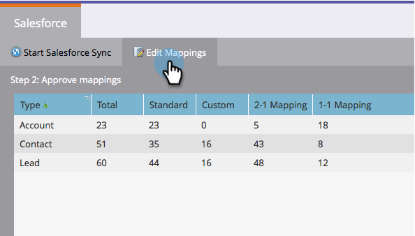
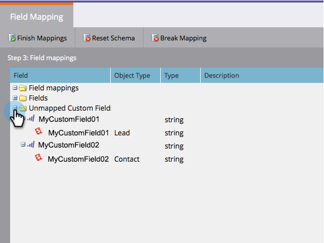
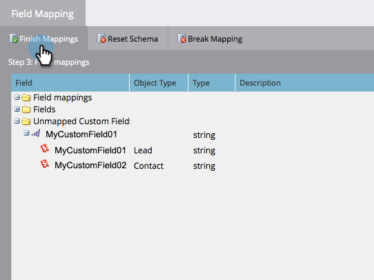
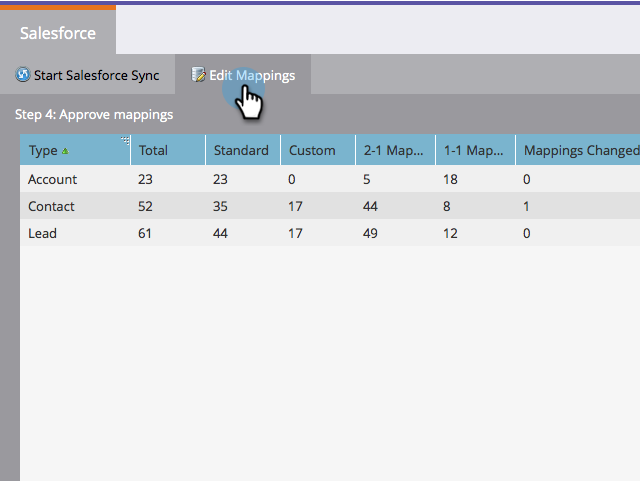
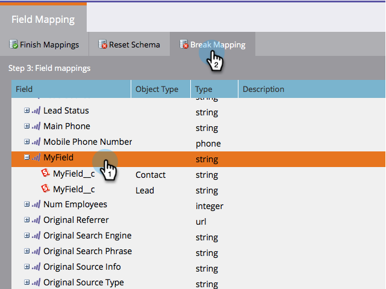

# Edit Initial Field Mappings {#edit-initial-field-mappings}

>[!NOTE]
>
>**Reminder**
>
>This feature is only accessible before the initial sync to Salesforce! Once the **Sync Now** button is pressed, this can no longer be done.

During the initial sync to Salesforce, Marketo automatically combines similarly named custom fields into a single field on the Marketo side to ensure the data can be exchanged with both Lead and Contact objects in the CRM. This article explains how to customize these mappings.

## Map Unmapped Fields {#map-unmapped-fields}

When you see a field in the Unmapped Fields folder, it means that it's not mapped to a similar field on the Lead or Contact in Salesforce. You can fix that.

1. Click Edit Mappings.

1. Open the **Unmapped Custom Fields** folder.

   

1. Drag one unmapped custom field onto another to map them together.

   >[!NOTE]
   >
   >You can only edit custom field mappings. Standard field mappings cannot be modified.

   

1. Click **Finish Mappings** when you are done.

   

## Break Existing Mapping {#break-existing-mapping}

If you have similarly named fields on the lead and contact object Marketo will map them together automatically. You may consider them to be different and to hold different data. Break the mapping like so.

1. Click **Edit Mappings**.

   

1. Highlight a mapped field and click **Break Mapping** to separate the fields.

   

1. Click **Finish Mappings** when you are done.

   

   Nice! You're almost done with the initial sync.

## Reset Schema {#reset-schema}

1. If you make some changes to the schema in Salesforce while working on the mappings, you can pull the changes by clicking **Reset Schema**.

    * All the mapping changes will be reset!
    * Resetting the schema will only add fields, not remove (even if you hide them from the sync user).

   

