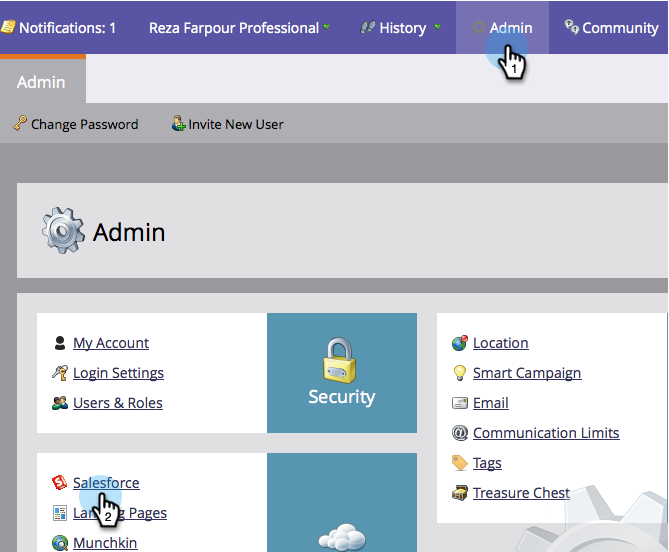
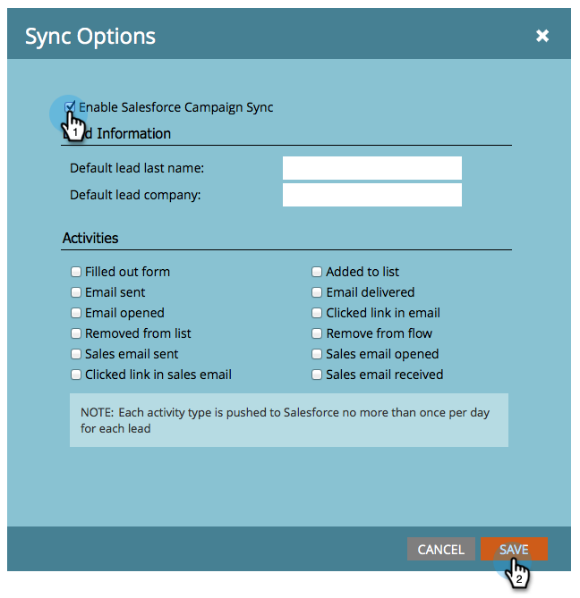

# Enable/Disable Campaign Sync {#enable-disable-campaign-sync}

Enable/Disable Campaign Sync - Marketo Docs - Product Documentation

>[!NOTE]
>
>Admin rights required.

This option allows Marketo to sync its program membership and statuses with Salesforce campaigns and vice versa.

1. Go to **Admin, **click **Salesforce.**

   ** 

   **

1. Click **Edit Sync Settings**.

   

1. Check **Enable Salesforce Campaign Sync** and click **SAVE**.

   

There you have it. Just give the sync some time to pull the data from Salesforce and you are good to go.

>[!NOTE]
>
>**Related Articles**
>
>* [SFDC Sync: Campaign Sync](../../../../../product-docs/crm-sync/salesforce-sync/sfdc-sync-details/sfdc-sync-campaign-sync.md)
>* [Set Default Lead Last Name and Company Values](set-default-person-last-name-and-company-name.md)
>* [Customize Activities Sync](customize-activities-sync.md)
>

