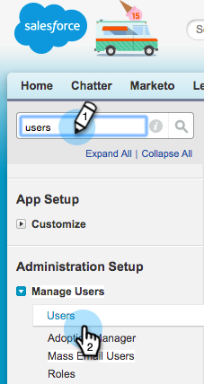
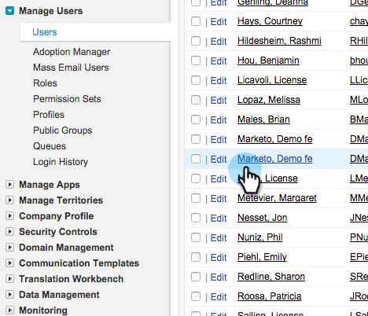

# Make Marketo Sync User a Marketing User {#make-marketo-sync-user-a-marketing-user}

The [Marketo sync user](../../../../../../product-docs/crm-sync/salesforce-sync/setup/enterprise-unlimited-edition/step-2-of-3-create-a-salesforce-user-for-marketo-enterprise-unlimited.md) needs to be a Marketing user for the Salesforce campaign sync to work properly. Here is how to make the user a Marketing user in Salesforce.

>[!NOTE]
>
>**Admin Permissions Required**

1. Log in to Salesforce. Search for users in the left search bar and click **Users** under **Managing Users**.

   

1. Find your sync user and click their name.

   

1. Click **Edit**.

   

1. Check the **Marketing User** check box and click **Save**.

   

   Great! This Marketo sync user is now a marketing user.

