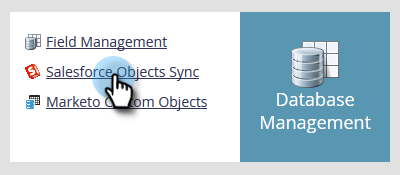
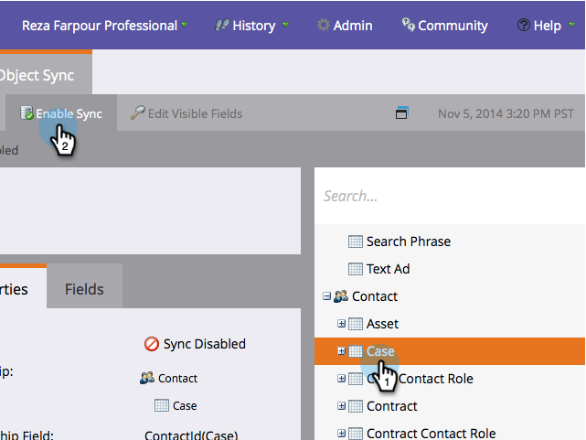
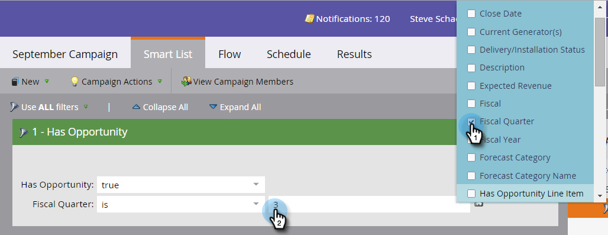

# Enable/Disable Custom Object Sync {#enable-disable-custom-object-sync}

Custom Objects created in your Salesforce instance can be part of Marketo Engage, too. Here's how to set it up.

## Enable/Disable Custom Object Sync {#enable-disable-custom-object-sync-1}

>[!NOTE]
>
>**Admin permissions required**

1. Click **[!UICONTROL Admin]**.

   

1. In the Database Management menu, click **[!UICONTROL Salesforce Objects Sync]**.

   

1. If this is your first Custom Object, click **[!UICONTROL Sync schema]**. Otherwise click **[!UICONTROL Refresh Schema]** to ensure you have the latest.

   

1. If your global sync is running you will have to disable it by clicking **[!UICONTROL Disable Global Sync]**.

   

   >[!NOTE]
   >
   >A sync of the Salesforce custom object schema may take a few minutes.

1. Click **[!UICONTROL Refresh Schema]**.

   

1. Select the object you wish to sync and click **[!UICONTROL Enable Sync]**.

   >[!TIP]
   >
   >Marketo can only sync a custom object if it has a direct relationship with the Lead, Contact or Account object in Salesforce.

   

1. Click **[!UICONTROL Enable Sync]** again.

   

1. Go back to the **[!DNL Salesforce]** tab and click **[!UICONTROL Enable Sync]**.

   

## Using Your Custom Objects {#using-your-custom-objects}

>[!NOTE]
>
>You cannot use custom objects in Smart Campaigns with triggers.

1. In your Smart List, drag over the **[!UICONTROL Has Opportunity]** filter and set to **[!UICONTROL true]**.

   

1. Then, use filter constraints to narrow the focus.

   

   Excellent! You can now use this custom object's data in Smart Campaigns and Smart Lists.

>[!MORELIKETHIS]
>
>[Add/Remove Custom Object Field as Smart List/Trigger Constraints](/help/marketo/product-docs/crm-sync/salesforce-sync/setup/optional-steps/add-remove-custom-object-field-as-smart-list-trigger-constraints.md){target="_blank"}
