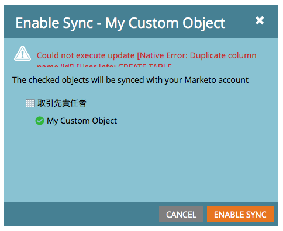
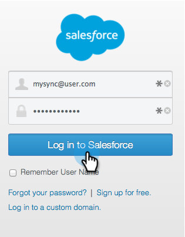
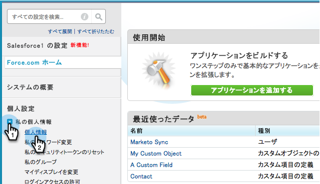
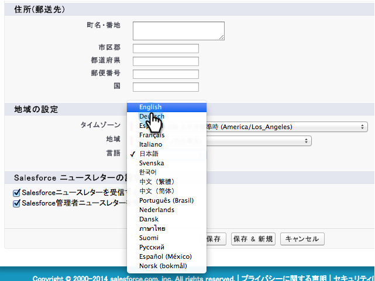
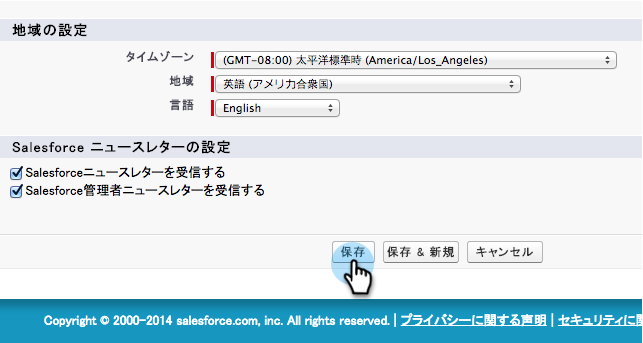
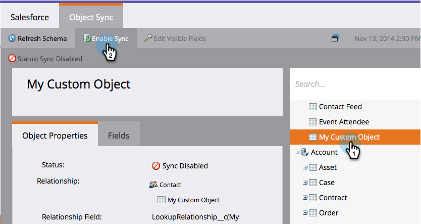
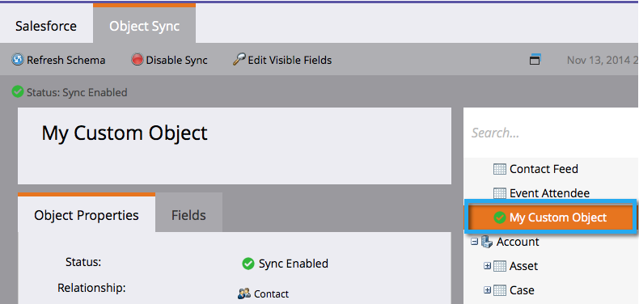

# Enable Non-English Custom Object Sync {#enable-non-english-custom-object-sync}

If your Marketo sync user is set to a language other than English you may run into an error when trying to enable a custom object sync.

## The Error {#the-error}

## Getting Around It {#getting-around-it}

1. Log in to Salesforce using the marketo sync user.

   

1. Under the user name, go to **Setup**.

   

1. Under **Personal Information**, click **My Personal Information**.

   

1. Click **Edit**.

   

1. Change the **Language** to **English**.

   

1. Click **Save**.

   

1. Back in Marketo, under **Admin > Salesforce > Objects** click **Refresh Schema**.

   

1. This will pull the objects list in English. Now select the object of your choice and click **Enable Sync**.

   

1. Notice your custom object is now enabled and synching.

   

1. Now go back to Salesforce and use the above steps to change the sync user back to your preferred language.

>[!NOTE]
>
>Don't forget to Refresh Schema one last time to pull the objects back in your language.
