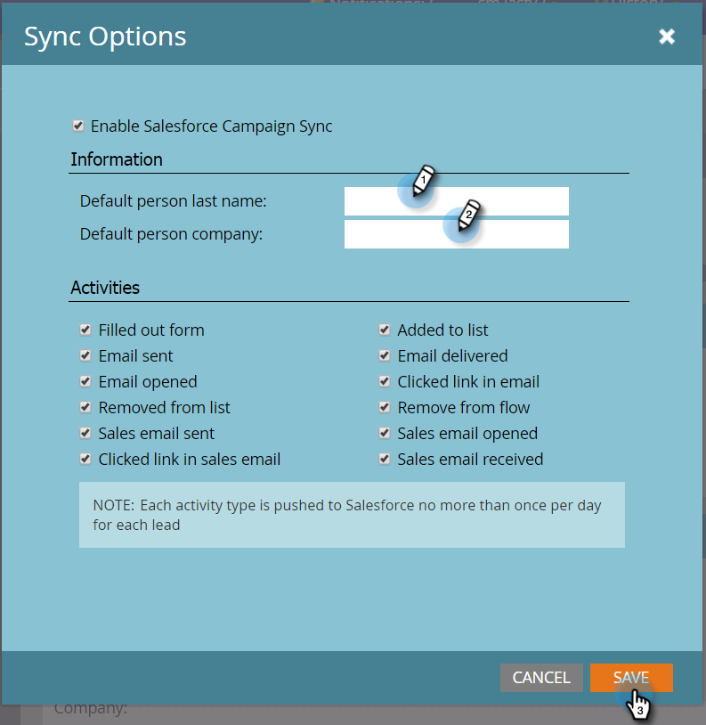

# Set Default Person Last Name and Company Name {#set-default-person-last-name-and-company-name}

Set Default Person Last Name and Company Name - Marketo Docs - Product Documentation

>[!NOTE]
>
>**FYI**
>
>Marketo is now standardizing language across all subscriptions, so you may see lead/leads in your subscription and person/people in docs.marketo.com. These terms mean the same thing; it does not affect article instructions. There are some other changes, too. [Learn more](http://docs.marketo.com/display/DOCS/Updates+to+Marketo+Terminology).

Salesforce requires (minimum)&nbsp;**last name**&nbsp;and&nbsp;**company name**&nbsp;for its Leads and Contacts.&nbsp;Incomplete records will not sync to Salesforce. If you wish to sync partial records, you must set default values for Marketo to use with Salesforce.

1. Go to **Admin** and click **Salesforce**.

   

1. Click **Edit Sync Options**.

   

1. Enter a&nbsp;**Default person last name**&nbsp;and a&nbsp;**Default ****person company**&nbsp;then click&nbsp;**SAVE**.

   

And that's that! Every time a person is missing a last name and/or company name, Marketo will add the default value as it syncs the record over.
