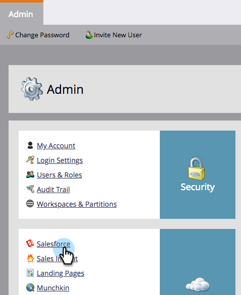

# Turn Off Email Notifications to Lead Owner {#turn-off-email-notifications-to-lead-owner}

You can disable the automatic email notifications that are sent to Lead Owners in Salesforce upon Lead Assignment. Here's how.

1. Go to **Admin**.

   

1. Click **Salesforce**.

   

1. Under **Sync Options**, click **Edit**.

   

1. Uncheck the **Send email notification to owner in Salesforce upon lead assignment** box. Click **Save**.

   
