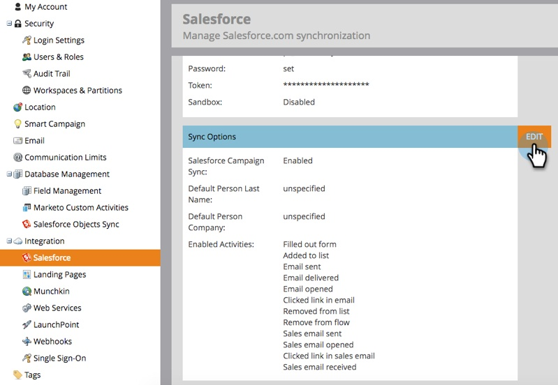

# Turn Off Email Notifications to Lead Owner {#turn-off-email-notifications-to-lead-owner}

You can disable the automatic email notifications that are sent to Lead Owners in Salesforce upon Lead Assignment. Here's how.

1. Go to **[!UICONTROL Admin]**.

   

1. Click **[!DNL Salesforce]**.

   

1. Under **[!UICONTROL Sync Options]**, click **[!UICONTROL Edit]**.

   

1. Uncheck the **[!UICONTROL Send email notification to owner in Salesforce upon lead assignment]** box. Click **[!UICONTROL Save]**.

   
