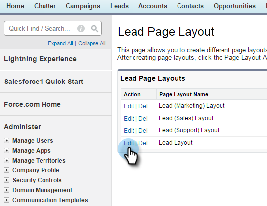
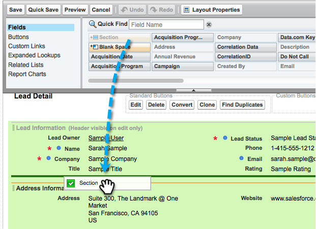
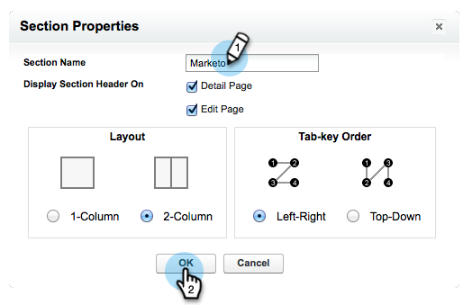
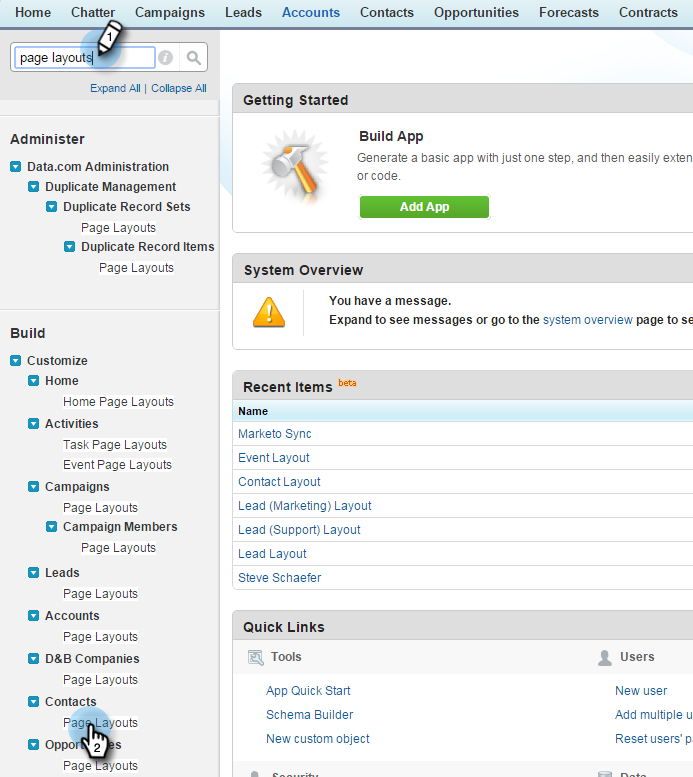
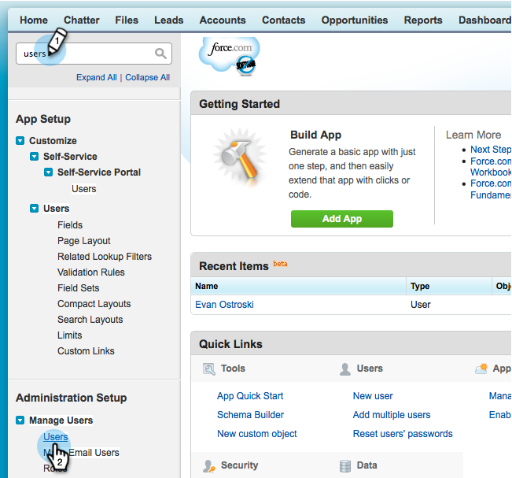

# Step 2 of 3: Create a Salesforce User for Marketo (Professional) {#step-of-create-a-salesforce-user-for-marketo-professional}

>[!NOTE]
>
>These steps must be completed by a Salesforce administrator.

>[!PREREQUISITES]
>
>[Step 1 of 3: Add Marketo Fields to Salesforce (Professional)](/help/marketo/product-docs/crm-sync/salesforce-sync/setup/professional-edition/step-1-of-3-add-marketo-fields-to-salesforce-professional.md){target="_blank"}

In this article, you will customize field permissions with a Salesforce Page Layout and create a Marketo-Salesforce sync user.

## Set Page Layouts {#set-page-layouts}

Salesforce Professional sets field level accessibility with Page Layouts, as opposed to Salesforce Enterprise/Unlimited's Profiles. Following these steps will allow the Marketo sync user to update the custom fields.

1. Type "[!UICONTROL page layouts]" in the Nav search bar without pressing **[!UICONTROL Enter]**, and click **[!UICONTROL Page Layout]** under **[!UICONTROL Leads]**.

   

1. Click **[!UICONTROL Edit]** next to Lead Layout.

   

1. Click and drag a new **[!UICONTROL Section]** into the page layout.

   

1. Enter "Marketo" for **[!UICONTROL Section Name]** and click **[!UICONTROL OK]**.

   

1. Click and drag the field **[!UICONTROL Acquisition Date]** into the **Marketo** section.

   

1. Repeat the above step for the following fields:

    * Acquisition Program
    * Acquisition Program Id
    * Email Opt Out
    * Inferred City
    * Inferred Company
    * Inferred Country
    * Inferred Metropolitan Area
    * Inferred Phone Area Code
    * Inferred Postal Code
    * Inferred State Region
    * Lead Score
    * Original Referrer
    * Original Search Engine
    * Original Search Phrase
    * Original Source Info
    * Original Source Type

   >[!NOTE]
   >
   >These fields need to be on the page layout so that Marketo can read/write to them.

   >[!TIP]
   >
   >Create two columns for the fields by dragging down to the right side of the page. You can move fields from one side to the other to balance the column lengths.

1. Click **[!UICONTROL Save]** when finished adding fields.

   

1. Repeat all of the above steps for the Salesforce **[!UICONTROL Contact Page Layout]**.

   

1. Remember to click **[!UICONTROL Save]** when you are done with the **[!UICONTROL Contact Page Layout]**.

   

   >[!NOTE]
   >
   >Make sure that the **[!UICONTROL All-Day Event]** field has been added to the **[!UICONTROL Event Page Layout]**.

## Create Sync User {#create-sync-user}

Marketo requires credentials to access Salesforce. This is best done with a dedicated user created with the steps below.

>[!NOTE]
>
>If your organization has no additional Salesforce licenses, you can use an existing Marketing user with the System Administrator profile.

1. Enter "users" in the Nav search bar, and click **[!UICONTROL Users]** under **[!UICONTROL Manage Users]**.

   

1. Click **[!UICONTROL New User]**.

   

1. Fill in the required fields, select the **[!UICONTROL User License: Salesforce]**, set the **[!UICONTROL Profile: System Administrator]**, check **[!UICONTROL Marketing User]** and click **[!UICONTROL Save]**.

   

   >[!TIP]
   >
   >Make sure the email address you enter is valid. You will need to log in as the sync user to reset the password.

Excellent! Now you have an account that Marketo can use to connect to Salesforce. Let's do it.

>[!MORELIKETHIS]
>
>[Step 3 of 3: Connect Marketo and Salesforce (Professional)](/help/marketo/product-docs/crm-sync/salesforce-sync/setup/professional-edition/step-3-of-3-connect-marketo-and-salesforce-professional.md){target="_blank"}
