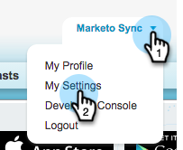
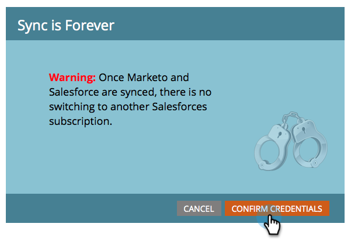
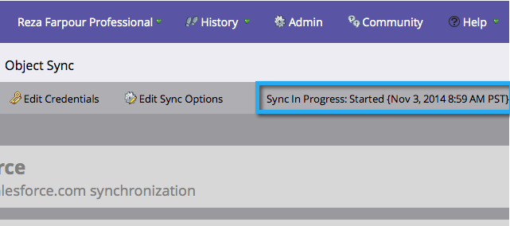

# Step 3 of 3: Connect Marketo and Salesforce (Professional) {#step-of-connect-marketo-and-salesforce-professional}

In this article, you will configure Marketo to sync with your configured Salesforce instance.

>[!NOTE]
>
>**Prerequisites**
>
>* [Step 1 of 3: Add Marketo Fields to Salesforce (Professional)](step-1-of-3-add-marketo-fields-to-salesforce-professional.md)
>* [Step 2 of 3: Create a Salesforce User for Marketo (Professional)](step-2-of-3-create-a-salesforce-user-for-marketo-professional.md)
>

## Retrieve Sync User Security Token {#retrieve-sync-user-security-token}

>[!TIP]
>
>If you already have the security token, proceed directly to Set Sync User Credentials and kudos for preparation!

1. Log into Salesforce with the Marketo Sync User, click the sync user's name, then **My Settings**.

   

1. In the Nav search bar, type "reset" and click on **Reset My Security Token**.

   

1. Click **Reset Security Token**.

   

   The security token will be sent to you by email.

## Set Sync User Credentials {#set-sync-user-credentials}

1. In Marketo, go to **Admin**, select **CRM**, and click **Sync with [Salesforce.com](http://Salesforce.com)**

   

   >[!NOTE]
   >
   >**Reminder**
   >
   >
   >Be sure to [hide all fields you do not need](../../../../../product-docs/crm-sync/salesforce-sync/sfdc-sync-details/sfdc-sync-field-sync/hide-a-salesforce-field-from-the-marketo-sync.md) in Marketo from the sync user before clicking **Sync Fields**. Once you click Sync Fields all fields the user can see will be created in Marketo permanently and cannot be deleted.

1. Enter the Salesforce Sync User credentials created in part 2 of the Salesforce configuration ([Professional](https://community.marketo.com/MarketoArticle?id=kA050000000LJ3QCAW), [Enterprise](https://community.marketo.com/MarketoArticle?id=kA050000000LIwKCAW)) and click **Sync Fields**.

   

   >[!NOTE]
   >
   >Check **Sandbox** if you are syncing a Marketo Sandbox to a Salesforce Sandbox.

1. Read the warning, then click **Confirm Credentials**.

   

   >[!CAUTION]
   >
   >If you want to look over the [mappings and customize them](../../../../../product-docs/crm-sync/salesforce-sync/setup/optional-steps/edit-initial-field-mappings.md), this is your only chance to do so! Once you click Start Salesforce Sync, it's done.

## Start Salesforce Sync {#start-salesforce-sync}

1. Click **Start Salesforce Sync** to begin the persistent Marketo-Salesforce sync.

   

   >[!CAUTION]
   >
   >Marketo will not automatically de-dupe against a Salesforce sync, or when you manually enter leads.

1. Click **START SYNC**.

   

   >[!NOTE]
   >
   >The time to complete the initial sync varies depending on the size and complexity of your database.

## Verify Sync {#verify-sync}

Marketo provides status messages for the Salesforce sync in the Admin area. You can verify the sync is working correctly by following these steps.

1. In Marketo, click **Admin**, then **Salesforce**.

   

1. The sync status is visible in the upper-right corner. It will show one of three messages: **Last Synced**, **Sync in Progress**, or **Failed**.

   

   

   

Wow, you just finished configuring one of the most powerful features of Marketo, go you!

>[!NOTE]
>
>**Related Articles**
>
>* [Install Marketo Sales Insight Package in Salesforce AppExchange](../../../../../product-docs/marketo-sales-insight/msi-for-salesforce/installation/install-marketo-sales-insight-package-in-salesforce-appexchange.md)
>* [Configure Marketo Sales Insight in Salesforce Professional Edition](../../../../../product-docs/marketo-sales-insight/msi-for-salesforce/configuration/configure-marketo-sales-insight-in-salesforce-professional-edition.md)
>* [Optional Steps](http://docs.marketo.com/display/docs/optional+steps)
>

