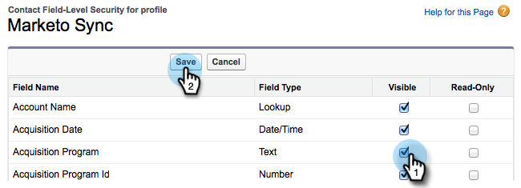

# Add an Existing Salesforce Field to the Marketo Sync {#add-an-existing-salesforce-field-to-the-marketo-sync}

>[!NOTE]
>
>**Admin Permissions Required**

Usually, new custom fields in Salesforce sync over to Marketo Engage automatically. If not, the fields may not be visible to the Marketo Sync user. Here's how you can fix this.

1. Click your name and then select **[!UICONTROL Setup]**.

   

1. Enter "profile" in the left search bar and click **[!UICONTROL Profiles]** under **[!UICONTROL Manage Users]**.

   

1. Click the sync user's profile.

   

1. Under the **[!UICONTROL Field-Level Security]** section, click **[!UICONTROL View]** next to the object that contains the field.

   

1. Click **[!UICONTROL Edit]**.

   

1. Check the **[!UICONTROL Visible]** checkbox for the field you want to add to the sync and click **[!UICONTROL Save]**.

   

   On the next sync cycle, Marketo will see the field and start the magic.

   >[!NOTE]
   >
   > If the field already has values in Salesforce, those values don't sync over to Marketo until the next record update.
