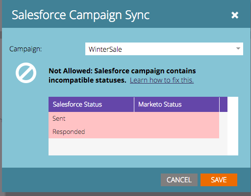

# How to Match Program Statuses and Salesforce Campaign Statuses Prior to Sync {#how-to-match-program-statuses-and-salesforce-campaign-statuses-prior-to-sync}

This article describes how to fix an incompatible status error and map statuses prior to Marketo Program and Salesforce Campaign sync.

## What Do You Do if You Received an Error Message {#what-do-you-do-if-you-received-an-error-message}

If you try to sync to an existing Salesforce Campaign that contains leads and the campaign contains one or more incompatible statuses, an error message displays. A Marketo Program and a Salesforce Campaign *will not* sync if the statuses are not an exact match.

From this error message, you can opt to:

1. Select a different campaign to sync to from the drop-down menu, OR
1. You can cancel out, fix the status errors, and try to sync once the errors are repaired. To fix the status errors, do one of the following:

    * Log in to Salesforce and remove or rename the incompatible Campaign Member Statuses to map to the Marketo Program Statuses used for the channel type associated with your Marketo Program.
    * Modify the Program Statuses in Marketo to map to the Salesforce Campaign Member Statuses you have in place. This is a Marketo Admin function. For details, see [Create a Program Channel](../../../../../product-docs/administration/tags/create-a-program-channel.md).

