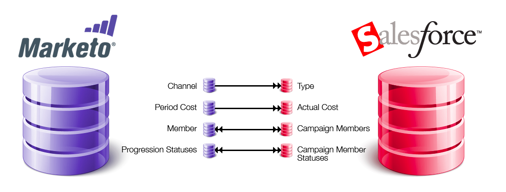

# SFDC Sync: Campaign Sync {#sfdc-sync-campaign-sync}

Marketo Programs can be synced with Salesforce Campaigns. Here is an overview of how this works.

### What's in this article? {#whats-in-this-article}

[Why should I sync Marketo programs with Salesforce campaigns?](#why-should-i-sync-marketo-programs-with-salesforce-campaigns)  
[How is a Marketo Program and a Salesforce campaign synced?](#how-is-a-marketo-program-and-a-salesforce-campaign-synced)  
[What are the triggers/filters related to campaigns?](#what-are-the-triggers-filters-related-to-campaigns)  
[Can I add Marketo People to my SFDC campaign?](#can-i-add-marketo-people-to-my-sfdc-campaign)  
[Can I remove members from my SFDC campaign using Marketo?](#can-i-remove-members-from-my-sfdc-campaign-using-marketo)  
[Can I change campaign member status using Marketo?](#can-i-change-campaign-member-status-using-marketo)  
[Why can't I see any of my Salesforce campaigns?](#why-cant-i-see-any-of-my-salesforce-campaigns)

#### Why should I sync Marketo programs with Salesforce campaigns? {#why-should-i-sync-marketo-programs-with-salesforce-campaigns}

* Use the powerful features of a Marketo Program.
* Keep members and their status in sync between a Marketo program and a Salesforce Campaign.
* Tap into the reporting features in Marketo and Salesforce.

#### How is a Marketo Program and a Salesforce campaign synced? {#how-is-a-marketo-program-and-a-salesforce-campaign-synced}

In Marketo, you have the option to create a one-to-one mapping between a program and a Salesforce campaign.

The ** [channel](../../../../product-docs/administration/tags/create-a-program-channel.md) **and ** [period cost](../../../../product-docs/core-marketo-concepts/programs/working-with-programs/understanding-period-costs.md)** in Marketo sync to Salesforce as the **campaign type** and **actual cost**. This sync is **one way**, from Marketo to Salesforce.

Marketo **program members** and their ** [progression statuses](../../../../product-docs/core-marketo-concepts/programs/creating-programs/understanding-program-membership.md)** are kept in sync with the **Salesforce campaign members** and **campaign member statues**. This is a **bidirectional** **sync**, so any changes made in either Marketo or Salesforce are reflected in both systems.

>[!NOTE]
>
>If there are members in the Marketo program that don't exist in Salesforce, Marketo creates those people as leads in Salesforce.

#### What are the triggers/filters related to campaigns? {#what-are-the-triggers-filters-related-to-campaigns}

Triggers:

* Added to SFDC Campaign
* Removed from SFDC Campaign
* Status is Changed in SFDC Campaign

Filters:

* Member of SFDC Campaign

#### Can I add Marketo People to my SFDC campaign? {#can-i-add-marketo-people-to-my-sfdc-campaign}

Yes, use the [Add to SFDC campaign flow action](../../../../product-docs/core-marketo-concepts/smart-campaigns/salesforce-flow-actions/add-to-sfdc-campaign.md). If this person doesn't exist in Salesforce, Marketo will create it in Salesforce and then add him/her to the campaign.

#### Can I remove members from my SFDC campaign using Marketo? {#can-i-remove-members-from-my-sfdc-campaign-using-marketo}

Yes, use the [Remove from SFDC Campaign flow action](../../../../product-docs/core-marketo-concepts/smart-campaigns/salesforce-flow-actions/remove-from-sfdc-campaign.md).

#### Can I change campaign member status using Marketo? {#can-i-change-campaign-member-status-using-marketo}

Yes, use the [Change Status in SFDC Campaign flow action](../../../../product-docs/core-marketo-concepts/smart-campaigns/salesforce-flow-actions/change-status-in-sfdc-campaign.md).

#### Why can't I see any of my Salesforce campaigns? {#why-cant-i-see-any-of-my-salesforce-campaigns}

Here are things you can check:

1. Make sure the [campaign sync is enabled](../../../../product-docs/crm-sync/salesforce-sync/setup/optional-steps/enable-disable-campaign-sync.md).
1. Confirm that your [Marketo Sync User](../../../../product-docs/crm-sync/salesforce-sync/setup/enterprise-unlimited-edition/step-2-of-3-create-a-salesforce-user-for-marketo-enterprise-unlimited.md) is a [Marketing User](../../../../product-docs/crm-sync/salesforce-sync/setup/optional-steps/enable-disable-campaign-sync/make-marketo-sync-user-a-marketing-user.md) in Salesforce.

>[!NOTE]
>
>If your Salesforce campaign and the mapped Marketo program have incompatible program statuses, you may receive an error message. We recommend that you [match the program statuses prior to the sync](sfdc-errors/how-to-match-program-statuses-and-salesforce-campaign-statuses-prior-to-sync.md).

>[!NOTE]
>
>**Related Articles**
>
>* [Sync an SFDC Campaign with a Program](../../../../product-docs/core-marketo-concepts/programs/working-with-programs/sync-an-sfdc-campaign-with-a-program.md)
>* [Understanding Program Membership](../../../../product-docs/core-marketo-concepts/programs/creating-programs/understanding-program-membership.md)
>* [Enable/Disable Campaign Sync](../../../../product-docs/crm-sync/salesforce-sync/setup/optional-steps/enable-disable-campaign-sync.md)
>* [Make Marketo Sync User a Marketing User](../../../../product-docs/crm-sync/salesforce-sync/setup/optional-steps/enable-disable-campaign-sync/make-marketo-sync-user-a-marketing-user.md)
>

