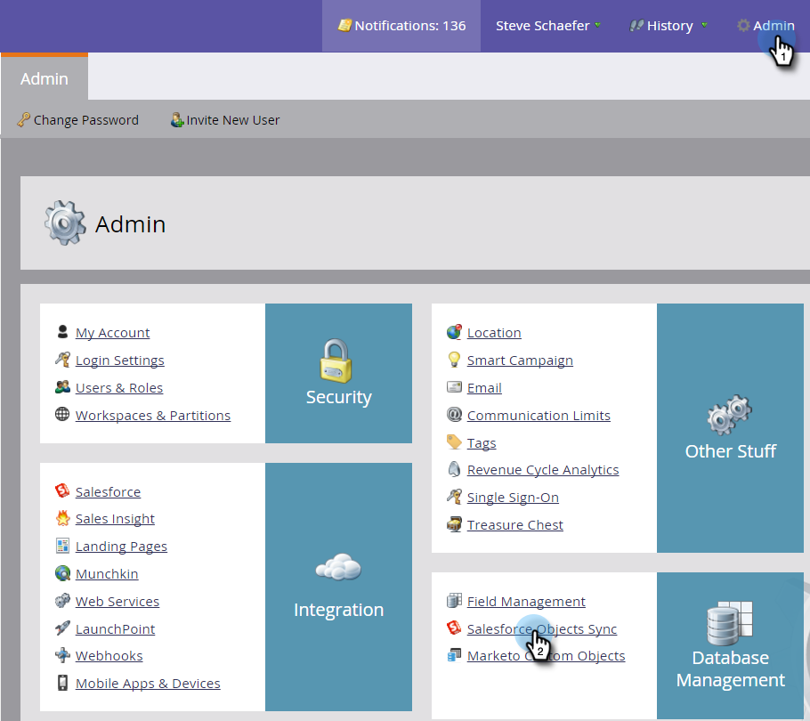
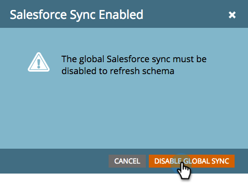
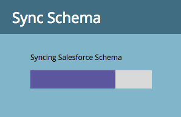
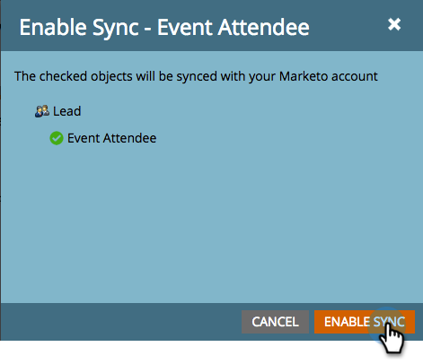
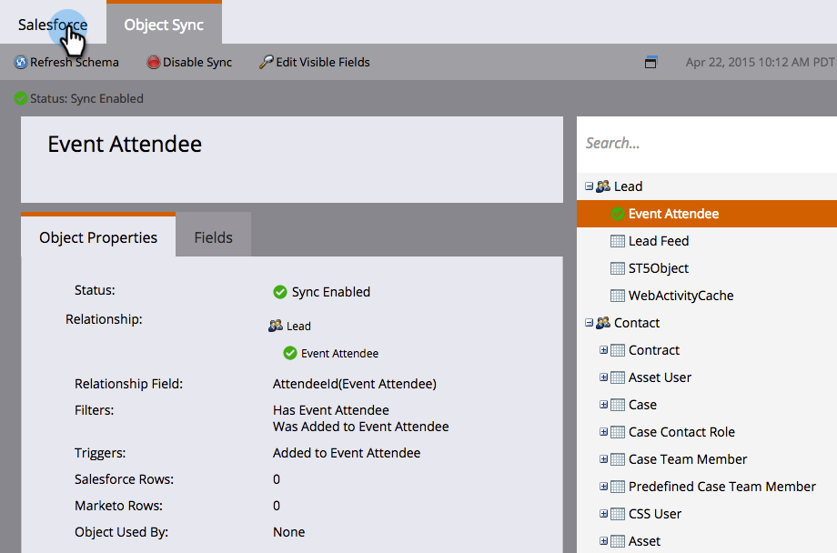
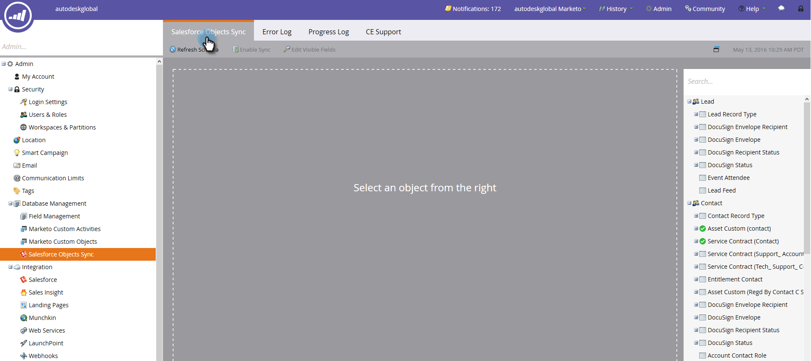

# SFDC Sync: Custom Object Sync {#sfdc-sync-custom-object-sync}

Custom Objects created in your Salesforce instance can be part of Marketo too.  Here's how to set it up.

>[!NOTE]
>
>**Admin Permissions Required**

>[!NOTE]
>
>**Prerequisites**
>
>To use a custom object, it must be associated to a [lead](sfdc-sync-lead-sync.md), [contact](sfdc-sync-contact-sync.md)or [account](sfdc-sync-account-sync.md)object in Salesforce.

## Enable Custom Object  {#enable-custom-object}

1. Click **Admin** and the** Salesforce Objects Sync **link**.**

   .

1. If this is your first Custom Object, click **Sync Schema.**

   

1. Click **Disable Global Sync.**

   

   >[!NOTE]
   >
   >An initial sync of the Salesforce custom object schema may take a few minutes.

   

1. Drag the custom object you wish to sync into the canvas.

   

   >[!NOTE]
   >
   >Custom objects must have unique names. Marketo does not support two different custom objects with the same name.

1. Click **Enable Sync.**

   

1. Click **Enable Sync** again.

   

   >[!NOTE]
   >
   >**Reminder**
   >
   >
   >Don't forget to re-enable your global sync!

1. Go back to the **Salesforce **tab.

   

1. Click **Enable Sync.**

   

1. To view all of your Salesforce custom objects, click **Admin** and the** Salesforce Objects Sync **link (same as step 1 above).

   

   >[!NOTE]
   >
   >Marketo only supports custom entities that are linked to standard entities one or two levels deep.

   ### What's Next: {#whats-next}

   [Add/Remove Custom Object Field as Smart List/Trigger Constraints](../../../../product-docs/crm-sync/salesforce-sync/setup/optional-steps/add-remove-custom-object-field-as-smart-list-trigger-constraints.md)

Excellent! You can now use data from this custom object in smart campaigns and smart lists.   

