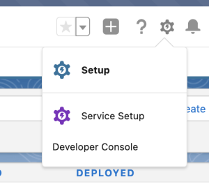
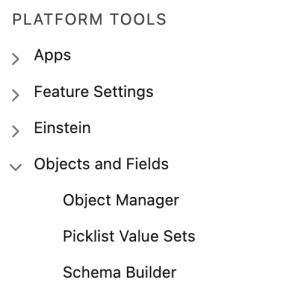
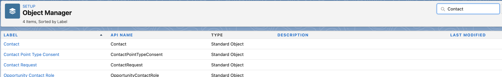
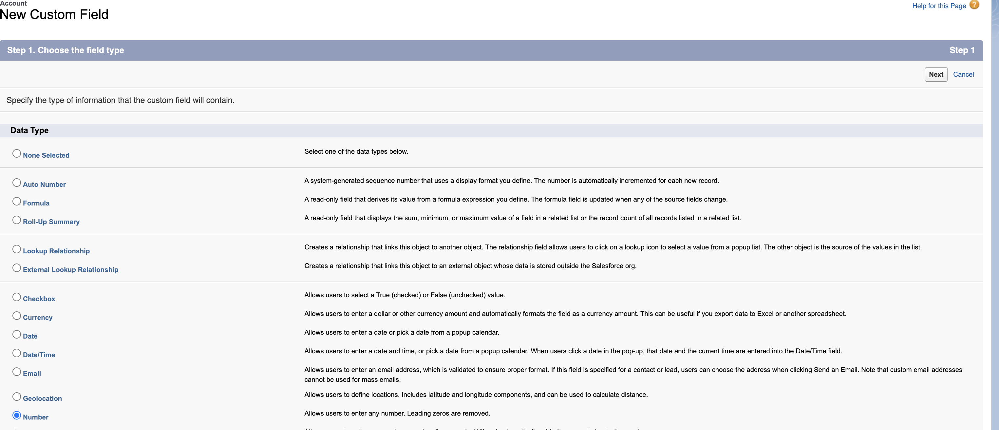
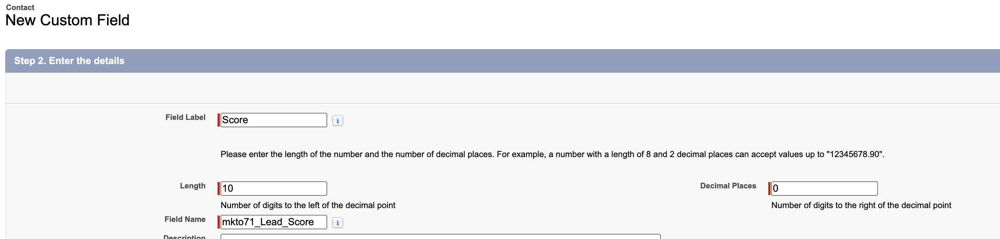
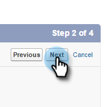
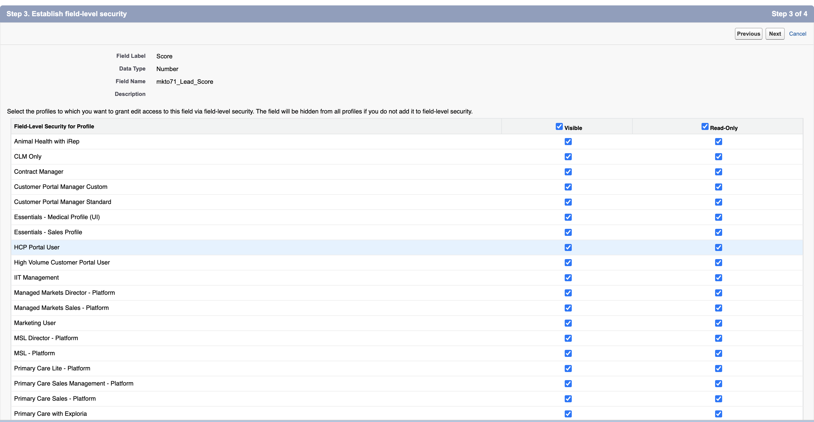
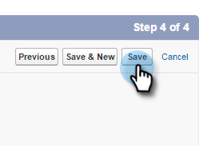

# Step 1 of 3: Add Marketo Fields to [!DNL Veeva] CRM {#step-1-of-3-add-marketo-fields-to-veeva-crm}

>[!PREREQUISITES]
>
>Your [!DNL Veeva] CRM instance must have access to Salesforce APIs to sync data between Marketo Engage and [!DNL Veeva] CRM.

Marketo Engage uses a set of fields to capture certain kinds of marketing related information. If you would like this data in [!DNL Veeva] CRM, please follow the instructions below.

`1.` Create a custom field in [!DNL Veeva] CRM on the contact objects: Score

`2.` You can create additional fields, if desired (see the table below).

All of these custom fields are optional and are not required to sync Marketo Engage and [!DNL Veeva] CRM.

## Add Marketo Fields to [!DNL Veeva] CRM {#add-marketo-fields-to-veeva-crm}

Add a custom field on the lead and contact objects in [!DNL Veeva] CRM listed above. If you want to add more, see the table of available fields at the end of this section.

Perform the following steps for the Score field to add it.

1. Log in to the [!DNL Veeva] CRM and click **[!UICONTROL Setup]**.

   

1. Click **[!UICONTROL Objects and Fields]** and select **[!UICONTROL Object Manager]**.

   

1. In the search bar, search for Contact.

   

1. Click the Contact object.

1. Select **[!UICONTROL Fields and Relationships]**.

1. Click **[!UICONTROL New]**.

   

1. Choose the appropriate field type (for Score — number).

   

1. Click **[!UICONTROL Next]**.

   

1. Enter the **[!UICONTROL Field Label]**, **[!UICONTROL Length]**, and **[!UICONTROL Field Name]** for the field, as shown in the table below.

<table>
 <tbody>
  <tr>
   <th>Field Label
   <th>Field Name
   <th>Data Type
   <th>Field Attributes
  </tr>
  <tr>
   <td>Score</td>
   <td>mkto71_Lead_Score</td>
   <td>Number</td>
   <td>Length 10 
Decimal Places 0</td>
  </tr>
 </tbody>
</table>

>[!NOTE]
>
>[!DNL Veeva] CRM appends __c to Field Names when it uses them to create API Names.

   

>[!NOTE]
>
>Text and number fields require a length, but Date/Time fields don’t. A description is optional.

1. Click **[!UICONTROL Next]**.

   

1. Specify the access settings and click **[!UICONTROL Next]**.

1. Set all roles to **[!UICONTROL Visible]** and **[!UICONTROL Read-Only]**.

1. Clear the **[!UICONTROL Read-Only]** checkbox for the profile of your sync user:

* If you have a user with the profile of a System Administrator as the sync user, clear the [!UICONTROL Read-Only] checkbox for the System Administrator profile (as shown below).
* If you created a custom profile for the sync user, clear the [!UICONTROL Read-Only] checkbox for that custom profile.

   

1. Choose the page layouts that should display the field.

1. Click **[!UICONTROL Save & New]** to go back and create each of the other two custom fields.

1. Click **[!UICONTROL Save]** when you’re done with all three.

   

>[!NOTE]
>
>Through adding the field to Contact object, they are added to Person Account object as well.

OPTIONAL: Use the above procedure for any additional custom fields from the table below.

<table>
 <tbody>
  <tr>
   <th>Field Label
   <th>Field Name
   <th>Data Type
   <th>Field Attributes
  </tr>
  <tr>
   <td>Inferred City</td>
   <td>mkto71_Inferred_City</td>
   <td>Text</td>
   <td>Length 255</td>
  </tr>
  <tr>
   <td>Inferred Company</td>
   <td>mkto71_Inferred_Company</td>
   <td>Text</td>
   <td>Length 255</td>
  </tr>
  <tr>
   <td>Inferred Country</td>
   <td>mkto71_Inferred_Country</td>
   <td>Text</td>
   <td>Length 255</td>
  </tr>
  <tr>
   <td>Inferred Metropolitan Area</td>
   <td>mkto71_Inferred_Metropolitan_Area</td>
   <td>Text</td>
   <td>Length 255</td>
  </tr>
  <tr>
   <td>Inferred Phone Area Code</td>
   <td>mkto71_Inferred_Phone_Area_Code</td>
   <td>Text</td>
   <td>Length 255</td>
  </tr>
  <tr>
   <td>Inferred Postal Code</td>
   <td>mkto71_Inferred_Postal_Code</td>
   <td>Text</td>
   <td>Length 255</td>
  </tr>
  <tr>
   <td>Inferred State Region</td>
   <td>mkto71_Inferred_State_Region</td>
   <td>Text</td>
   <td>Length 255</td>
  </tr>
 </tbody>
</table>

>[!NOTE]
>
>Values in the fields automatically assigned by Marketo will not immediately be available in [!DNL Veeva] CRM when the new field has been created. Marketo will sync the data to [!DNL Veeva] CRM upon the next update to the record on either system (i.e., an update to any of the fields in sync between Marketo and [!DNL Veeva] CRM).
