# Step 2 of 3: Create a [!DNL Veeva] CRM User for Marketo Engage {#step-2-of-3-create-a-veeva-crm-user-for-marketo-engage}

>[!NOTE]
>
>The steps in this article must be completed by a [!DNL Veeva] CRM administrator.

>[!PREREQUISITES]
>
>[Step 1 of 3: Add Marketo Fields to [!DNL Salesforce] (Professional)](/help/marketo/product-docs/crm-sync/veeva-crm-sync/setup/step-1-of-3-add-marketo-fields-to-veeva-crm.md){target="_blank"}

In this article, you'll customize field permissions with a [!DNL Veeva] CRM Page Layout and create a [!DNL Marketo-Veeva] CRM sync user.

## Set Page Layouts {#set-page-layouts}

Following these steps will allow the Marketo sync user to update the custom fields.

1. Click on the **[!UICONTROL Account]** (Person account) page layouts in the Nav search bar without pressing Enter, and click **[!UICONTROL Page Layout]** under [!UICONTROL Contacts].

   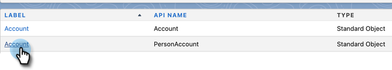

1. Click **[!UICONTROL Page Layouts]**.

   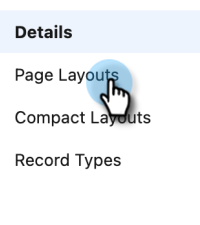

1. Click **[!UICONTROL HCP - Professional]**.

   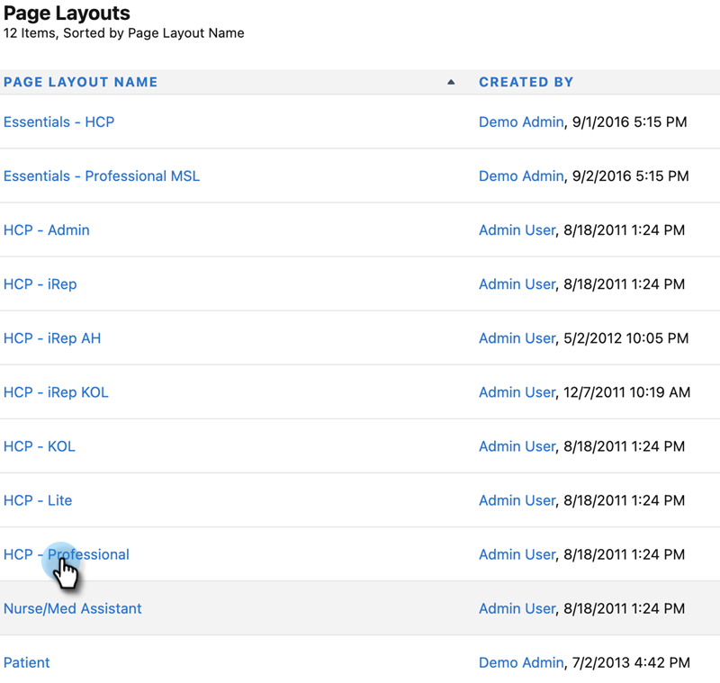

1. Click and drag a new **[!UICONTROL Section]** into the page layout.

1. Enter “Marketo” for **[!UICONTROL Section Name]** and click **[!UICONTROL OK]**.

   

1. Click and drag the **[!UICONTROL Score]** field into the Marketo section.

   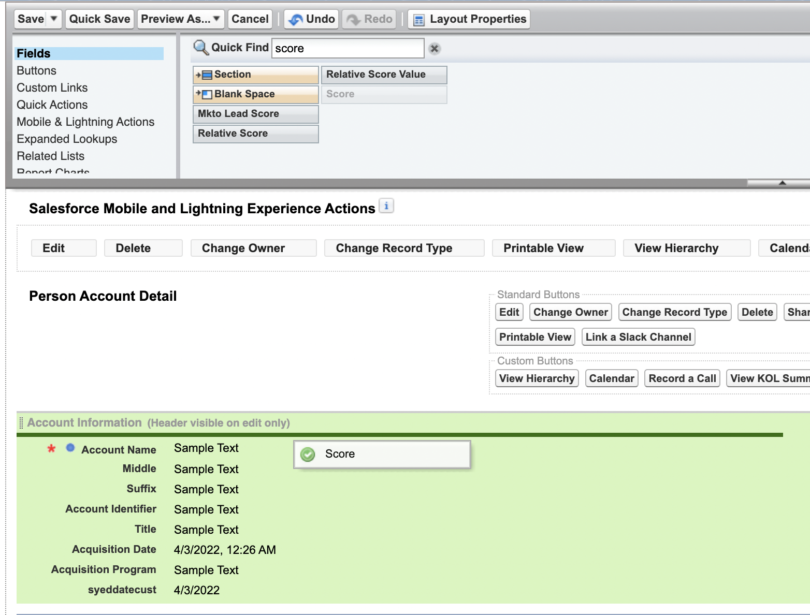

1. Repeat the above step for the following fields:

   * Inferred City
   * Inferred Company
   * Inferred Country
   * Inferred Metropolitan Area
   * Inferred Phone Area Code
   * Inferred Postal Code
   * Inferred State Region

   >[!NOTE]
   >
   >These fields need to be on the page layout so that Marketo can read/write to them.

   >[!TIP]
   >
   >Create two columns for the fields by dragging down to the right side of the page. You can move fields from one side to the other to balance the column lengths.

1. When you're done with the [!UICONTROL HCP-Professional] Layout, click **[!UICONTROL Save]**.

   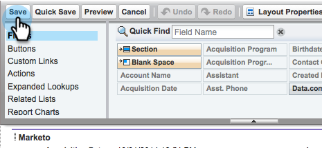

>[!NOTE]
>
>Repeat this for other [!UICONTROL Account] page Layouts.

## Create a Profile {#create-a-profile}

1. Click **[!UICONTROL Setup]**.

   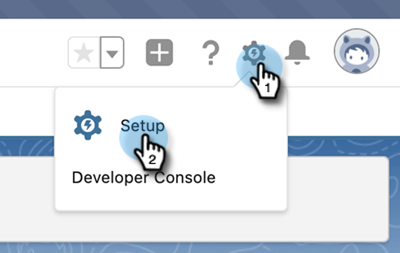

1. Type “profiles” into the Nav search bar and click the **[!UICONTROL Profiles]** link.

   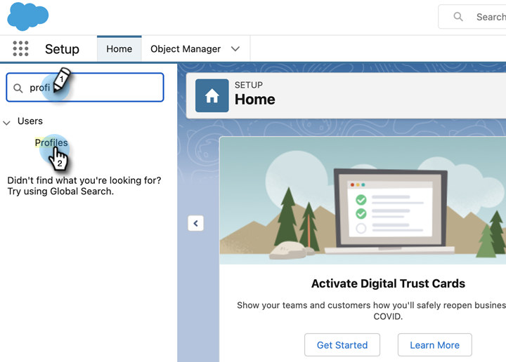

1. Click **[!UICONTROL New]**.

   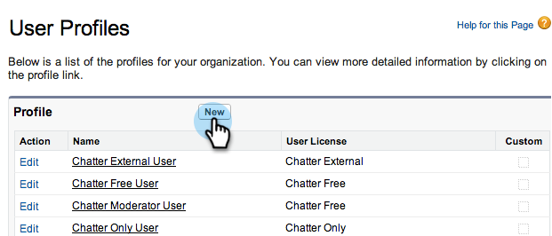

1. Select **[!UICONTROL Standard User]**, name the profile “[!UICONTROL Marketo-Salesforce Sync]” and click **[!UICONTROL Save]**.

   

## Set Profile Permissions {#set-profile-permissions}

1. Click **[!UICONTROL Edit]** to set the security permissions.

   

1. Under the [!UICONTROL Administrative Permissions] section, make sure [!UICONTROL API Enabled] is selected.

   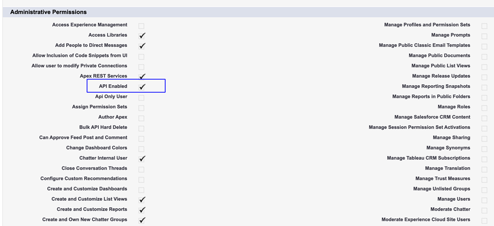

   >[!TIP]
   >
   >Be sure to check the [!UICONTROL Password Never Expires] box.

1. Under the [!UICONTROL General User Permissions] section, make sure [!UICONTROL Edit Events] and [!UICONTROL Edit Tasks] are selected.

   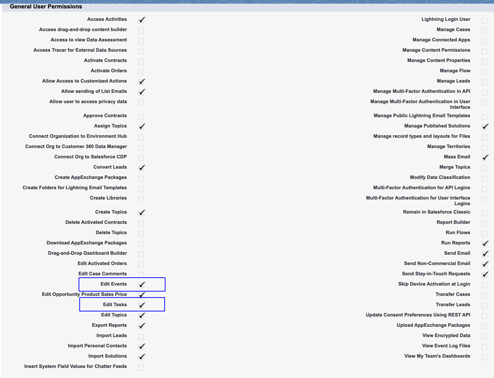

1. Under the [!UICONTROL Standard Object Permissions] section, make sure that [!UICONTROL Read], [!UICONTROL Create], [!UICONTROL Edit], and [!UICONTROL Delete] permissions are checked for [!UICONTROL Accounts] and [!UICONTROL Contacts].

   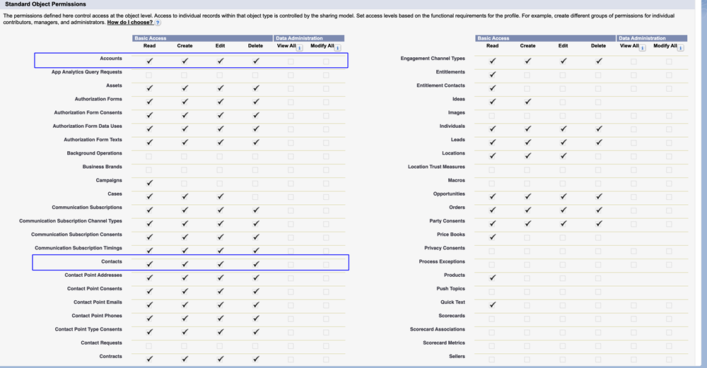

1. Under the [!UICONTROL Custom Object Permissions] section, make sure that [!UICONTROL Read] permissions are checked for [!UICONTROL Call], [!UICONTROL Call Key Message], and any other desired Custom Objects.

   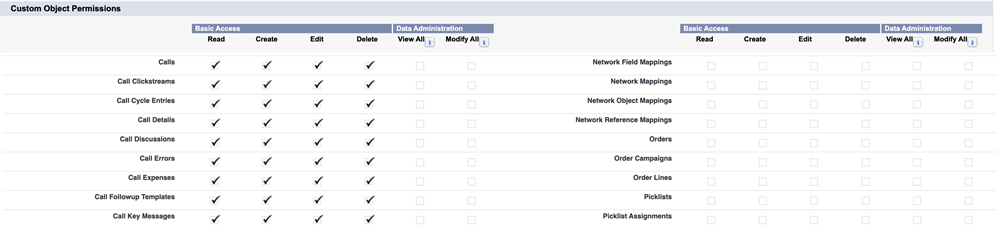

1. When finished, click **[!UICONTROL Save]** at the bottom of the page.

   

## Set Field Permissions {#set-field-permissions}

1. Discuss with your marketers to find out what custom fields are necessary to sync.

>[!NOTE]
>
>This step will prevent fields you don’t need from showing up in Marketo, which will reduce clutter and speed up sync.

1. In the [!UICONTROL profile detail] page, go to **[!UICONTROL Field-Level Security]** section. Click **[!UICONTROL View]** to edit the accessibility for the [!UICONTROL Contact] and [!UICONTROL Account] objects.

   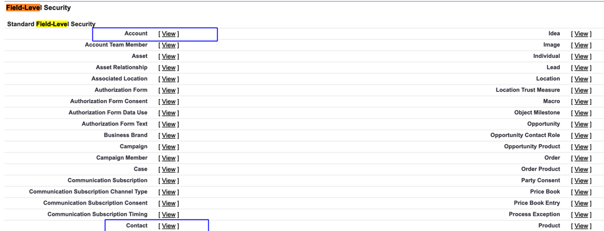

>[!TIP]
>
>You may configure other objects according to your organization’s needs.

1. For each object, click **[!UICONTROL Edit]**.

   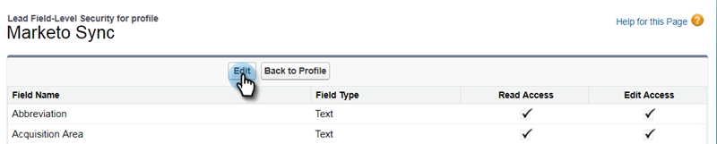

Locate the unnecessary fields, make sure that [!UICONTROL Read Access] and [!UICONTROL Edit Access] are **un**checked. Click **[!UICONTROL Save]** when done.

   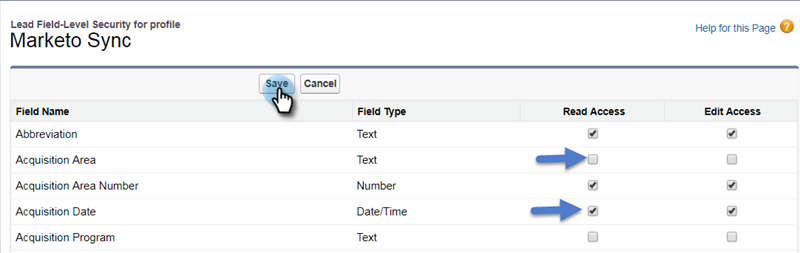

>[!NOTE]
>
>Only edit the accessibility for the custom fields.

1. After you finish disabling all unnecessary fields, check [!UICONTROL Read Access] and [!UICONTROL Edit Access] for the following object fields. Click **[!UICONTROL Save]** when done.

<table>
 <tbody>
  <tr>
   <th>Object
   <th>Fields
  </tr>
  <tr>
   <td>Account</td>
   <td>Type field</td>
  </tr>
  <tr>
   <td>Event</td>
   <td>All fields</td>
  </tr>
  <tr>
   <td>Task</td>
   <td>All fields</td>
  </tr>
 </tbody>
</table>

## Create Sync User {#create-sync-user}

Marketo requires credentials to access [!DNL Veeva] CRM. This is best done with a dedicated user created with the steps below.

>[!NOTE]
>
>If your organization has no additional [!DNL Veeva] CRM licenses, you can use an existing Marketing user with the System Administrator profile.

1. Enter “users” in the Nav search bar, and click **[!UICONTROL Users]** under [!UICONTROL Manage Users].

   

1. Click **[!UICONTROL New User]**.

   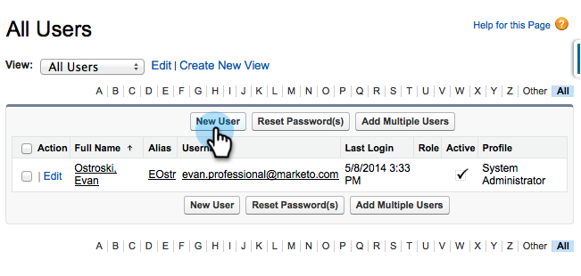

1. Fill in the required fields, select the **[!UICONTROL User License]**: **[!UICONTROL Salesforce]**, set the **[!UICONTROL Profile]**: **[!UICONTROL Marketo Sync]** User and click **[!UICONTROL Save]**.

   

>[!TIP]
>
>Make sure the email address you enter is valid. You will need to log in as the sync user to reset the password.

Excellent! Now you have an account that Marketo Engage can use to connect to [!DNL Veeva] CRM. Let’s do it.

>[!MORELIKETHIS]
>
>[Step 3 of 3: Connect Marketo and [!DNL Veeva] CRM](/help/marketo/product-docs/crm-sync/veeva-crm-sync/setup/step-3-of-3-connect-marketo-engage-and-veeva-crm.md){target="_blank"}
