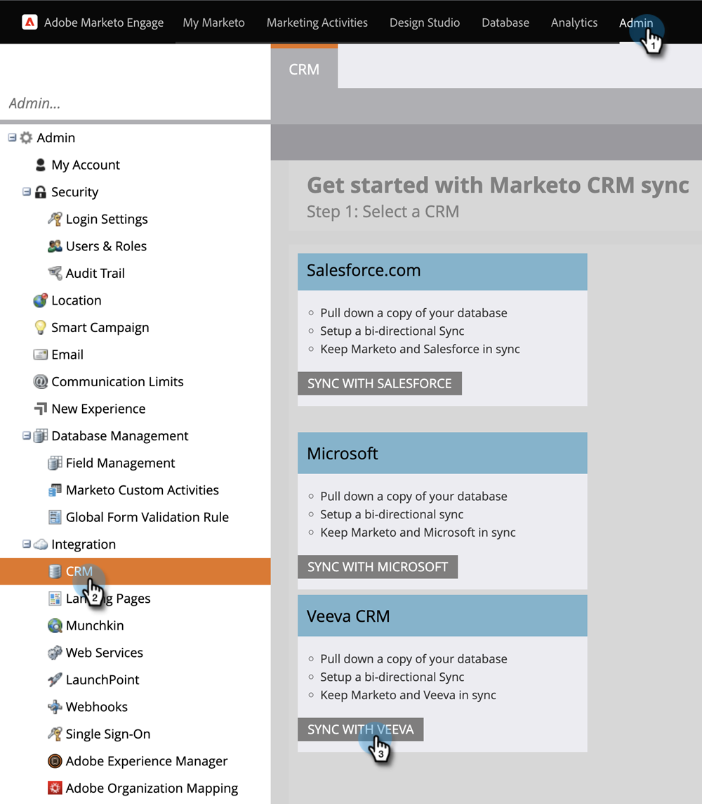
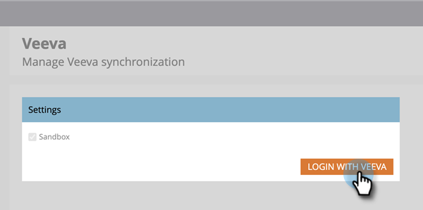
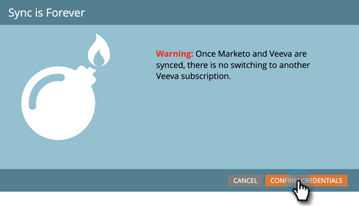
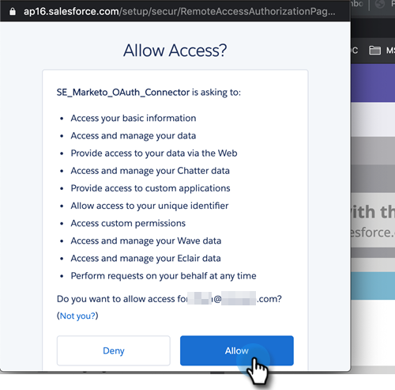
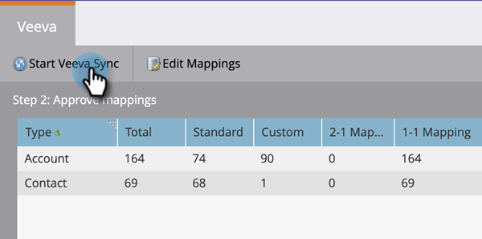
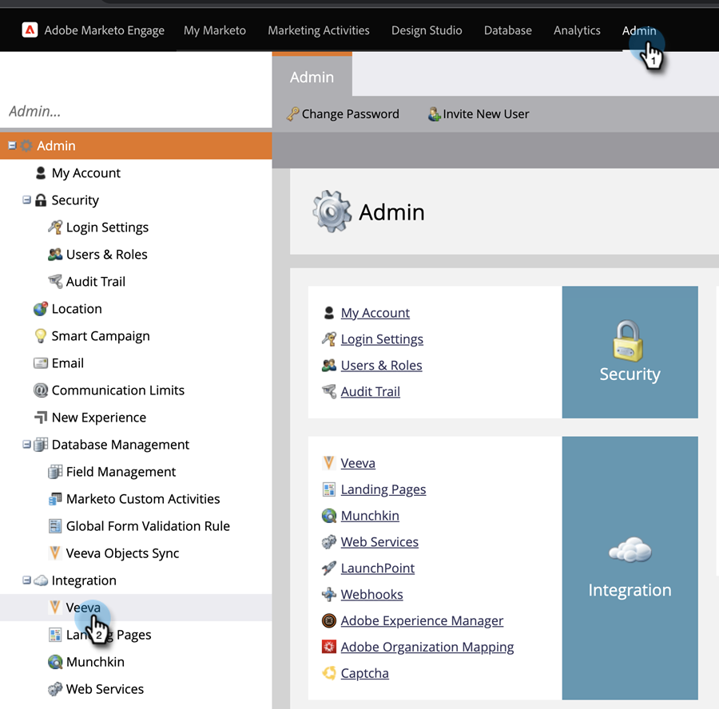

# Step 3 of 3: Connect Marketo Engage and Veeva CRM {#step-3-of-3-connect-marketo-engage-and-veeva-crm}

In this article, you'll configure Marketo Engage to sync with your configured Veeva CRM instance. **You'll see Salesforce in some of the pop-ups** as Veeva CRM is built on the Salesforce platform.

>[!PREREQUISITES]
>
>* [Step 1 of 3: Add Marketo Fields to Veeva](/help/marketo/product-docs/crm-sync/veeva-crm-sync/setup/step-1-of-3-add-marketo-fields-to-veeva-crm.md){target="_blank"}
>* [Step 2 of 3: Create a Veeva User for Marketo](/help/marketo/product-docs/crm-sync/veeva-crm-sync/setup/step-2-of-3-create-a-veeva-crm-user-for-marketo-engage.md){target="_blank"}

>[!IMPORTANT]
>
>Only one Marketo Instance can be connected to a Veeva CRM instance at a time.

## Connect to Veeva CRM using OAuth {#connect-to-veeva-crm-using-oauth}

1. In Marketo, Click **Admin**. Select **CRM** and click **Sync with Veeva**.

   

   >[!NOTE]
   >
   >Be sure to [hide all fields you don't need](/help/marketo/product-docs/crm-sync/salesforce-sync/sfdc-sync-details/hide-a-salesforce-field-from-the-marketo-sync.md){target="_blank"} in Marketo from the sync user before clicking Sync Fields. Once you click Sync Fields all fields the user can see will be created in Marketo permanently and cannot be deleted.

1. Click **Login with Veeva**.

   

   >[!NOTE]
   >
   >Check Sandbox if you're syncing a Marketo Sandbox to a Veeva CRM Sandbox.

1. Click **Confirm Credentials**.

   

1. A pop-up with the Salesforce login page will show up. Enter your “Marketo Sync User” credentials and click **Log In**.

   

1. Enter the verification code you received via email (sent by Salesforce) and click **Verify**.

   

1. Upon successful verification, the access page will show up requesting access. Click **Allow**.

   

1. In a few minutes, a pop-up will appear in Marketo Engae. Click **Confirm Credentials**.

   

## Start Veeva Sync {#start-veeva-sync}

1. Click **Start Veeva Sync** to begin the persistent Marketo-Veeva CRM sync.

   

   >[!CAUTION]
   >
   >Marketo will not automatically de-dupe against a Veeva CRM sync, or when you manually enter leads.

1. Click **Start Sync**.

   

>[!NOTE]
>
>The time to complete the initial sync varies depending on the size and complexity of your database.

## Verify Sync {#verify-sync}

Marketo provides status messages for the Veeva CRM sync in the Admin area. You can verify the sync is working correctly by following these steps.

1. In Marketo, click **Admin**, then **Veeva**.

   

1. The sync status is visible in the upper-right corner. It will show one of three messages: Last Synced, Sync in Progress, or Failed.

>[!MORELIKETHIS]
>
>[Configure Custom Objects](/help/marketo/product-docs/crm-sync/veeva-crm-sync/sync-details/custom-object-sync.md){target="_blank"}
