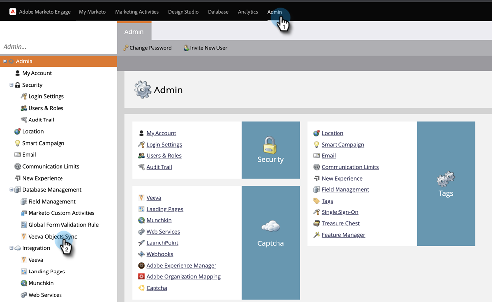
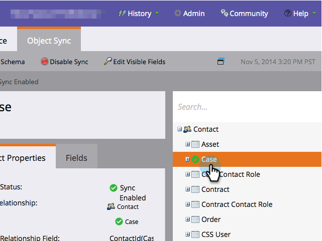
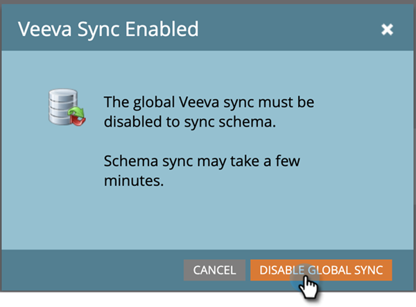
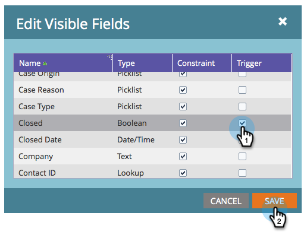
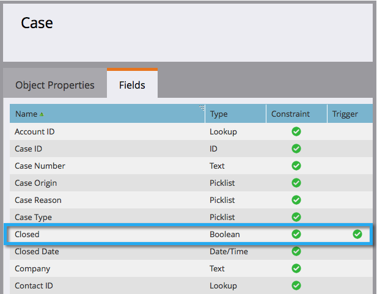

# Add/Remove Custom Object Field as Smart List/Trigger Constraints {#add-remove-custom-object-field-as-smart-list-trigger-constraints}

Marketo Engage provides specific control over the Veeva custom object sync. This allows you to select the fields available as constraints in custom object filters and to use them as triggers in Smart Campaigns.

>[!NOTE]
>
>**Admin Permissions Required**

1. Click **[!UICONTROL Admin]**, then **[!UICONTROL Veeva Objects Sync]**.

   

1. Select the object you wish to modify.

   

1. Click **[!UICONTROL Edit Visible Fields]**.

   

   >[!TIP]
   >
   >If the Edit Visible Fields button is greyed out, the object is currently in use in a Smart List or Smart Campaign. Remove all associations to proceed.

1. If your global sync is enabled, click **[!UICONTROL Disable Global Sync]**.

   

1. Check the boxes next to the desired filter/trigger constraints and click **[!UICONTROL Save]**.

   

   >[!NOTE]
   >
   >All fields are selected by default to be constraints on filters.

1. Click on the **[!UICONTROL Fields]** tab to confirm your changes.

   

>[!IMPORTANT]
>
>Don't forget to re-enable your global sync!

Now your Smart Lists and Smart Campaigns have even more power.

>[!MORELIKETHIS]
>
>[Enable/Disable Custom Object Sync](/help/marketo/product-docs/crm-sync/veeva-crm-sync/sync-details/enable-disable-custom-object-sync.md){target="_blank"}
