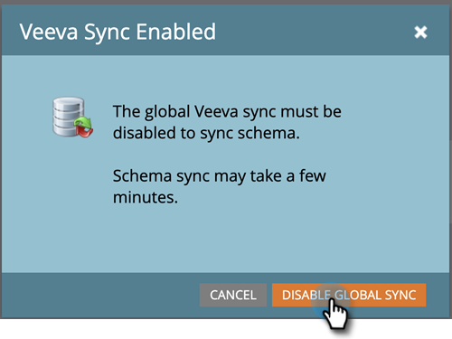
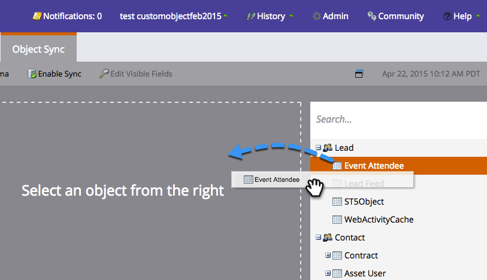
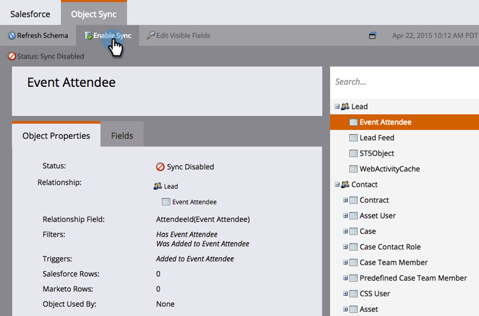
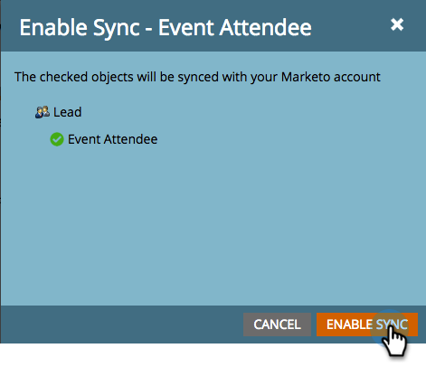
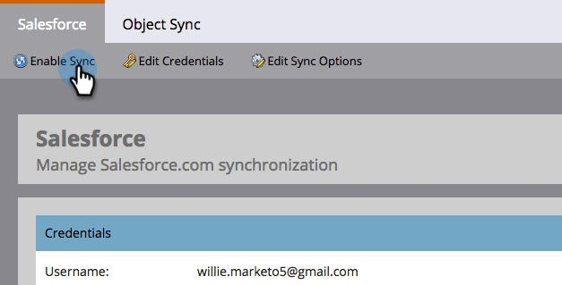
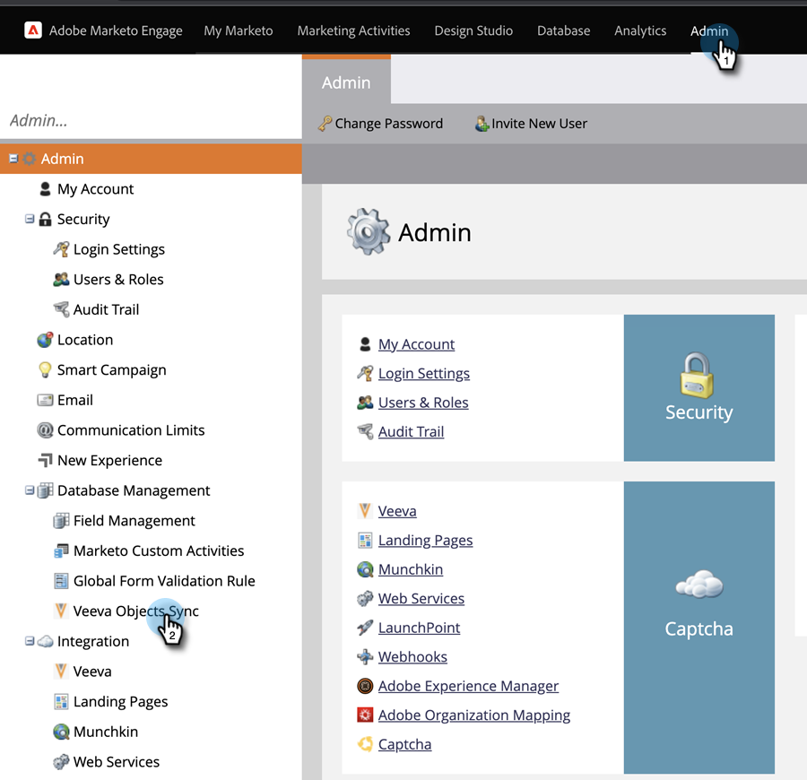

# Custom Object Sync {#custom-object-sync}

Custom Objects created in your Veeva CRM instance can be part of Marketo Engage, too. Here’s how to set it up.

>[!NOTE]
>
>**Admin permissions required**

>[!PREREQUISITES]
>
>To use a custom object, it must be associated to a contact or account object in Veeva CRM.

## Enable Custom Object {#enable-custom-object}

1. In Marketo, click **Admin**, then **Veeva Objects Sync**.

   

1. If this is your first Custom Object, click **Sync Schema**.

   

1. Click **Disable Global Sync**.

   

   >[!NOTE]
   >
   >The initial sync of the Veeva custom object schema may take a few minutes.

1. Drag the custom object you wish to sync into the canvas.

   

   >[!NOTE]
   >
   >Custom objects must have unique names. Marketo does not support two different custom objects with the same name.

1. Click **Enable Sync**.

   

1. Click **Enable Sync** again.

   

1. Go back to the **Veeva** tab.

   

1. Click **Enable Sync**.

   

1. To view all of your Veeva custom objects, click Admin and  Veeva Objects Sync.

   

   >[!NOTE]
   >
   >Marketo only supports custom entities that are linked to standard entities one to two levels deep.

Excellent! You can now use data from this custom object in Smart Campaigns and Smart Lists.

>[!MORELIKETHIS]
>
>* [Syncing Call and Call Key Messages](/help/marketo/product-docs/crm-sync/veeva-crm-sync/sync-details/syncing-call-and-call-key-messages.md){target="_blank"}
>* [Add/Remove Custom Object Field as Smart List/Trigger Constraints](/help/marketo/product-docs/crm-sync/veeva-crm-sync/sync-details/add-remove-custom-object-field-as-smart-list-trigger-constraints.md){target="_blank"}
