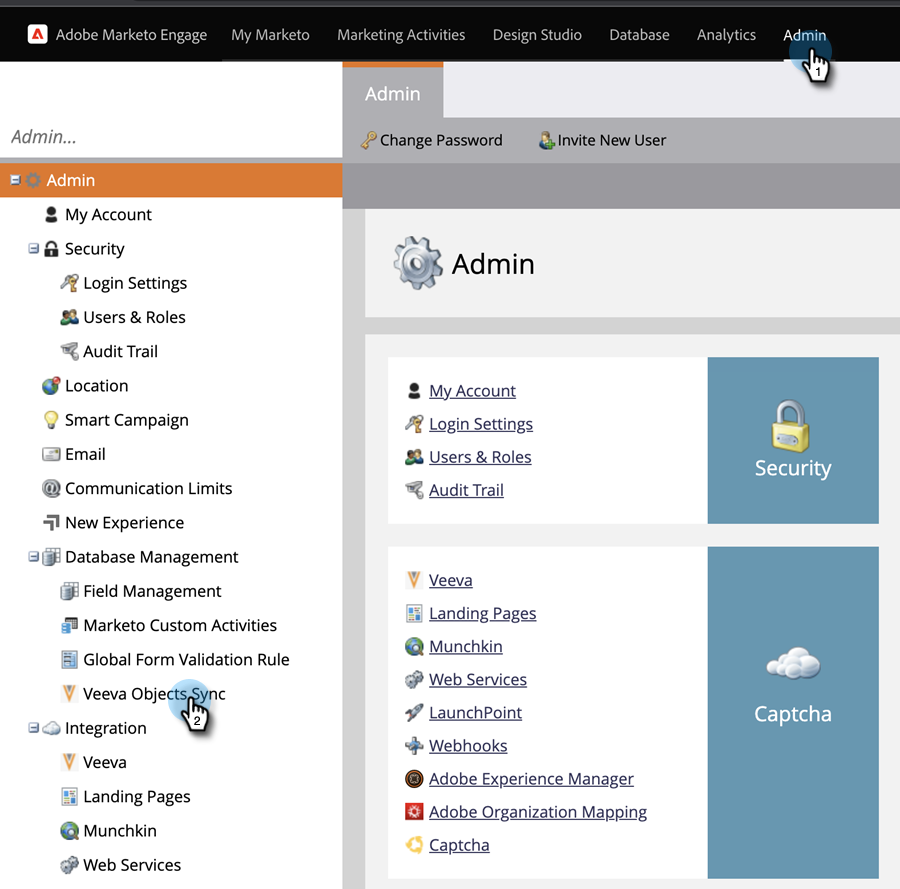
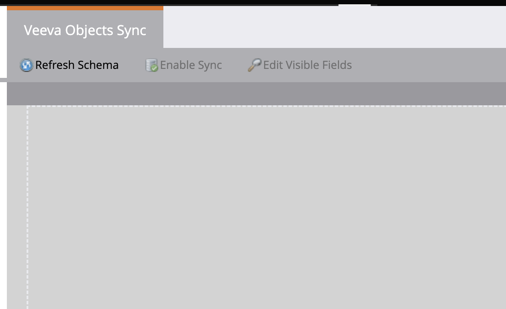
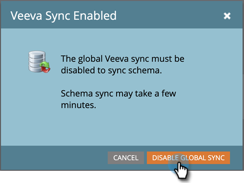
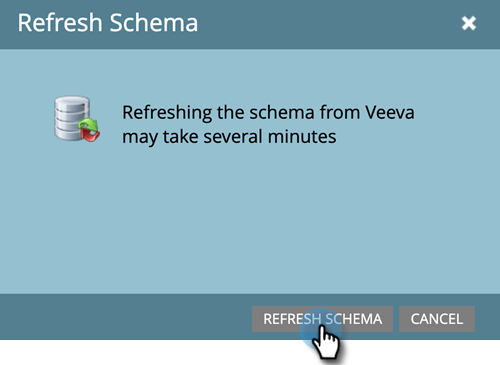
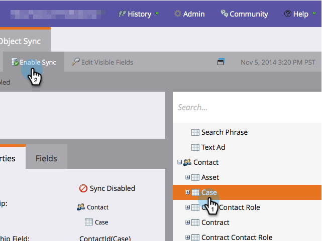
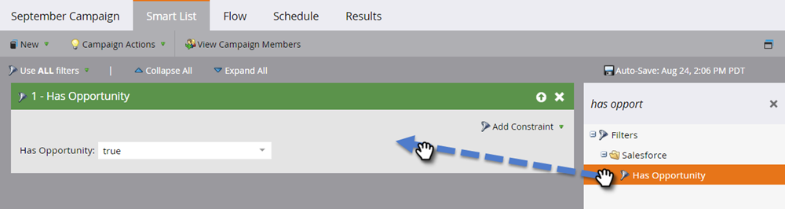
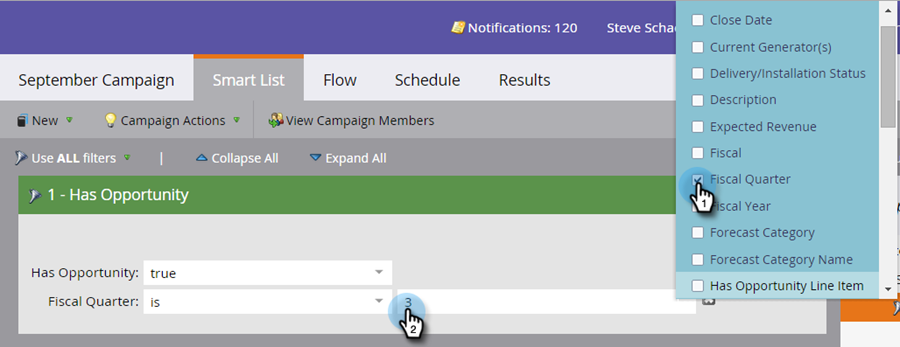

# Enable/Disable Custom Object Sync {#enable-disable-custom-object-sync}

Custom Objects created in your Veeva CRM instance can be part of Marketo Engage, too. Here’s how to set it up.

## Enable or Disable the Custom Object Sync {#enable-or-disable-the-custom-object-sync}

>[!NOTE]
>
>**Admin permissions required**

1. In Marketo, click **Admin**, then **Veeva Objects Sync**.

   

1. If this is your first Custom Object, click Sync Schema. If not, click **Refresh Schema** to ensure you have the latest.

   

1. If your global sync is running, disable it by clicking **Disable Global Sync**.

   

   >[!NOTE]
   >
   >A sync of the Veeva custom object schema may take a few minutes.

1. Click **Refresh Schema**.

   

Select the object you wish to sync and click Enable Sync.

   

   >[!TIP]
   >
   >Marketo can only sync a custom object if it has a direct relationship with the Contact or Account object in Veeva CRM.

1. Click **Enable Sync** again.

   

1. Go back to the Veeva tab and click **Enable Sync**.

   

## Using Your Custom Objects {#using-your-custom-objects}

>[!NOTE]
>
>You cannot use custom objects in smart campaigns with triggers.

1. In your Smart List, drag over the "Has Opportunity" filter and set to **True**.

   

1. Optionally, use filter constraints to narrow the focus.

   

Excellent! You can now use this custom object’s data in Smart Campaigns and Smart Lists.

>[!MORELIKETHIS]
>
>[Add/Remove Custom Object Field as Smart List/Trigger Constraints](/help/marketo/product-docs/crm-sync/veeva-crm-sync/sync-details/add-remove-custom-object-field-as-smart-list-trigger-constraints.md){target="_blank"}
