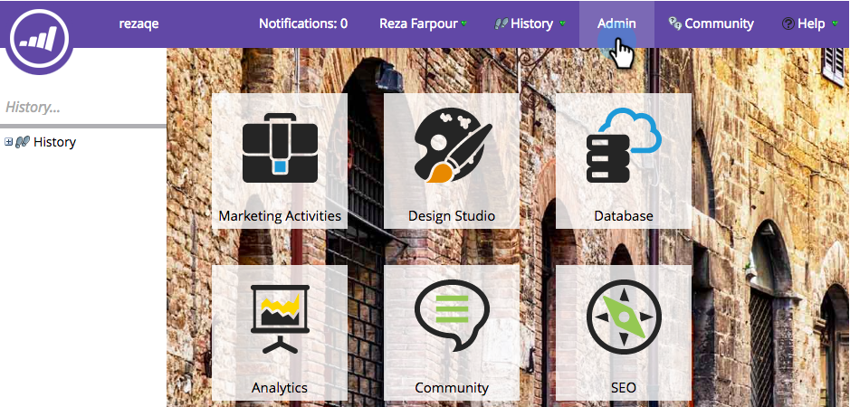
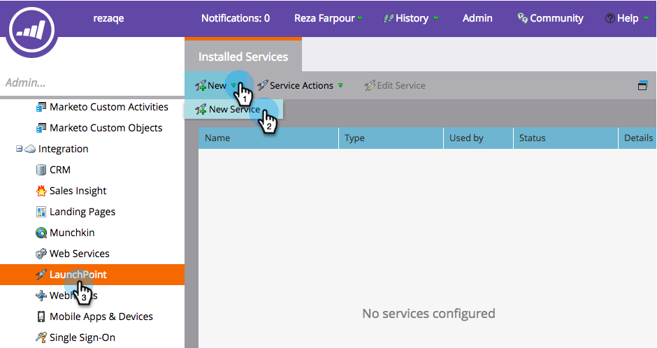
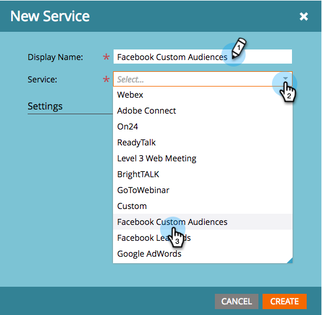
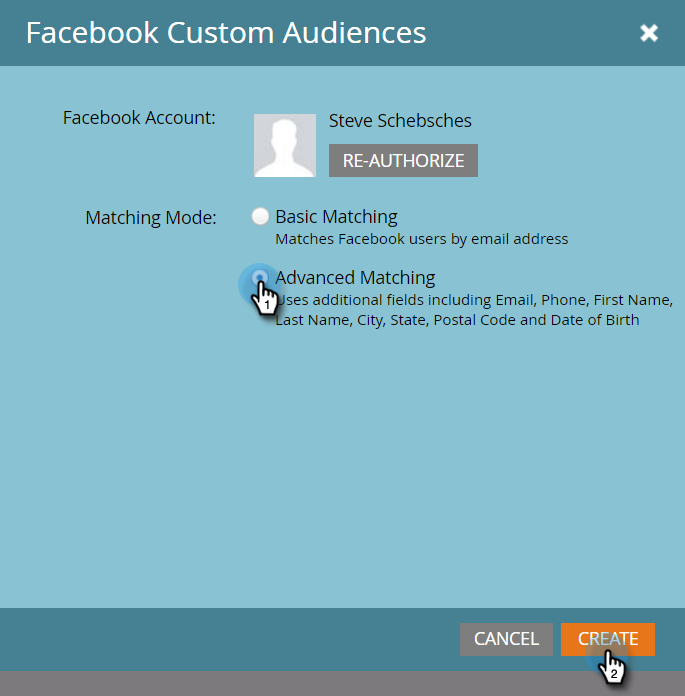

# Add Facebook Custom Audiences as a LaunchPoint Service {#add-facebook-custom-audiences-as-a-launchpoint-service}

>[!NOTE]
>
>**Admin Permissions Required**

With this integration you can send audience data from Marketo static and smart lists to Facebook to be used as Custom Audiences in Facebook Ad Campaigns. Here's how to set it up.

1. Go to Marketo **Admin**.

   

1. Go to **LaunchPoint**, click on **New** and select **New Service**.

   

1. Enter a **Display Name** for your service and select the **Facebook Custom Audiences** service from the **Service** drop-down.

   

1. Open a new tab in the same browser and go to [facebook.com](https://www.facebook.com/). Log in to Facebook using the account you want to use for the integration.

   >[!CAUTION]
   >
   >In order for Marketo to send audiences across multiple Ad Manager Accounts, the Facebook user you authorize in the following steps needs to have access to *all* of these accounts.

   

1. After you're logged into Facebook, return to Marketo. Click **Authorize**.

   

   >[!NOTE]
   >
   >You _must_ use a Facebook Business Manager account in order for your Custom Audiences integration to work. To learn how to set up a Business Manager account, refer to [Facebook Help](https://www.facebook.com/business/help/1710077379203657).

1. If prompted, click **OK** to accept the Marketo app installation into Facebook.

   

1. You're now authorized! Select a matching mode and click **Create**.

   >[!NOTE]
   >
   >**Basic Matching** uses only email addresses. **Advanced Matching** uses seven additional fields, which increases the match rate, for more conversion. However, if your company's privacy policy doesn't permit sharing additional fields, or if your data doesn't include them, select Basic Matching.

   

   Great job! You can now go over to any static or smart list in Marketo and send audience data over to Facebook.

   >[!CAUTION]
   >
   >Oh, before you go, be sure to [Accept Facebook's Custom Audiences Terms](https://www.facebook.com/ads/manage/customaudiences/tos.php) within your Facebook account! Without doing this, the audience updates will fail.

>[!MORELIKETHIS]
>
>* [Create a Custom Audience in Facebook](/help/marketo/product-docs/demand-generation/facebook/create-a-custom-audience-in-facebook.md)
>
>* [Set Up Facebook Lead Ads](/help/marketo/product-docs/demand-generation/facebook/set-up-facebook-lead-ads.md)
