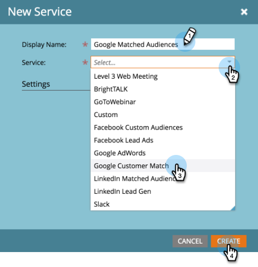
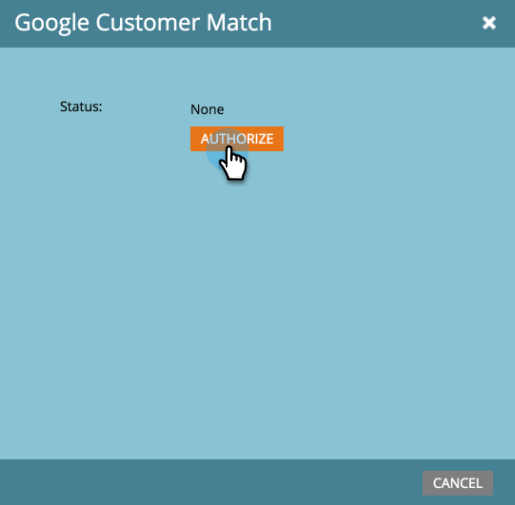
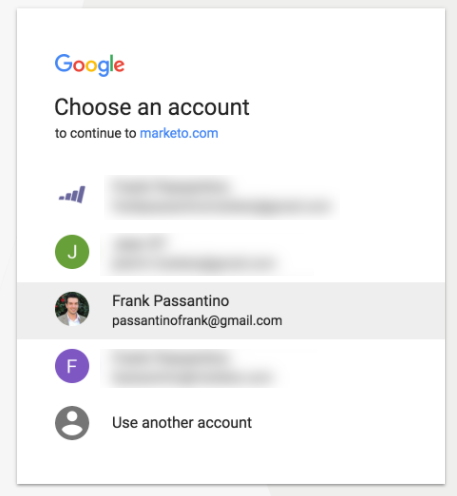
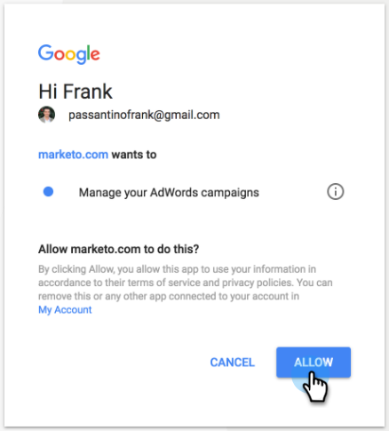

# Add Google Customer Match as a LaunchPoint Service {#add-google-customer-match-as-a-launchpoint-service}

With this integration, you can send a Marketo audience to Google to be targeted using Google AdWords, as well as re-target audiences across YouTube, Search, and Gmail.

>[!NOTE]
>
>**Admin Permissions Required**

1. Go to **Admin**.

   

1. Click **LaunchPoint**.

   

1. Select **New** then **New Service**.

   

1. Enter a **Display Name** and select **Google Customer Match** from the **Service** drop-down. Click **Create**.

   

1. To connect a Google AdWords account, click **Authorize**.

   

1. Google opens in a new tab. From here, log in to your Google AdWords account.

   >[!CAUTION]
   >
   >In order for Marketo to send audiences across multiple AdWords Accounts, the Google user you authorize in the following steps needs to have access to _all_ of these accounts.

   

1. Review the requested permissions, then click **Allow**.

   

1. Your Google AdWords account is now connected to Marketo. Click **Create**.

   

   Awesome! You'll now see Google Matched Audiences listed as a LaunchPoint service in the Installed Services tab.
