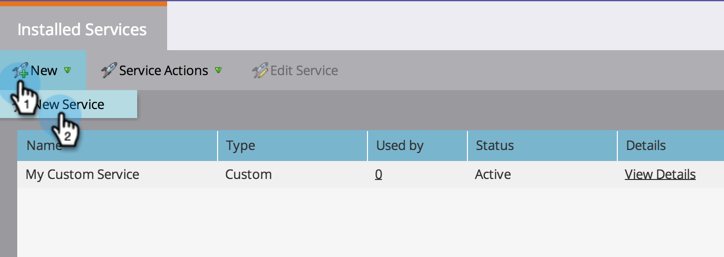
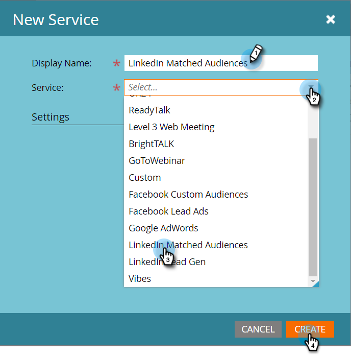
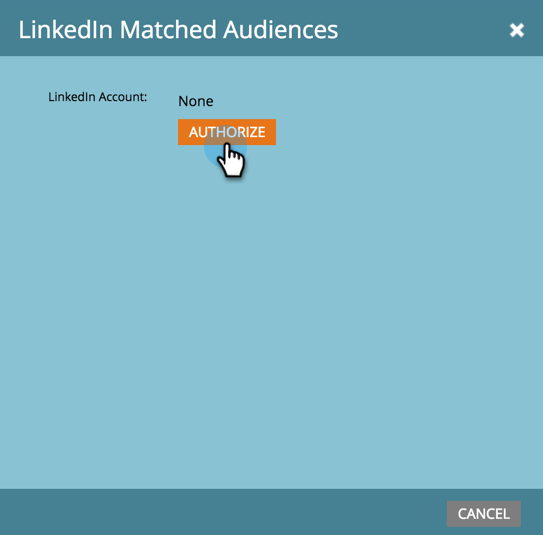
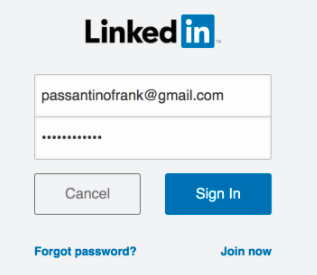
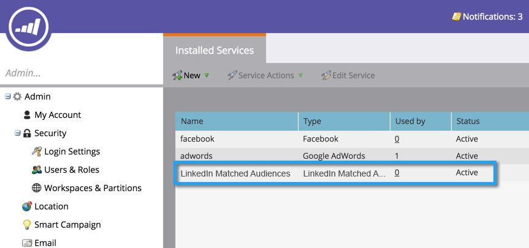

# Add LinkedIn Matched Audiences as a LaunchPoint Service {#add-linkedin-matched-audiences-as-a-launchpoint-service}

>[!NOTE]
>
>**Admin Permissions Required**

Connect your Marketo account with LinkedIn Matched Audiences to use a Marketo static list or smart list as a LinkedIn audience segment.

1. Go to the **Admin** section.

   

1. Select **Launchpoint**.

   

1. Select **New** and **New Service**.

   

1. Enter a **Display Name** and choose **LinkedIn Matched Audiences**. Click **Create**.

   

1. To connect a LinkedIn account, click **Authorize**.

   

   >[!CAUTION]
   >
   >In order for Marketo to send audiences across multiple LinkedIn Ad Accounts, the LinkedIn user you authorize in the following steps needs to have access to *all* of these Ad accounts in their Campaign Manager.

1. LinkedIn opens in a new tab. From here, log in to your LinkedIn account.

   

1. Review the requested permissions, then click **Allow**.

   

1. Your LinkedIn account is now connected to Marketo. Click **Create**.

   

   Awesome! You'll now see LinkedIn Matched Audiences listed as a LaunchPoint service in the Installed Services tab.

   

>[!MORELIKETHIS]
>
>[Use a Marketo List or Smart List as a LinkedIn Audience Segment](/help/marketo/product-docs/demand-generation/social/social-functions/use-a-marketo-list-or-smart-list-as-a-linkedin-audience-segment.md)
