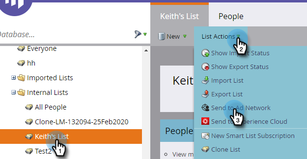
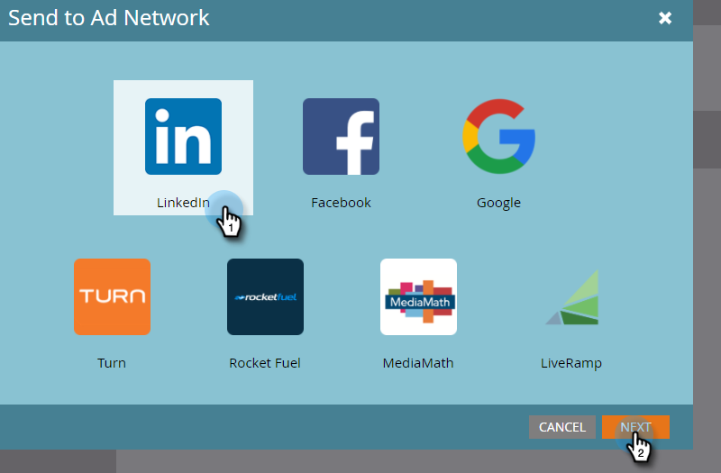
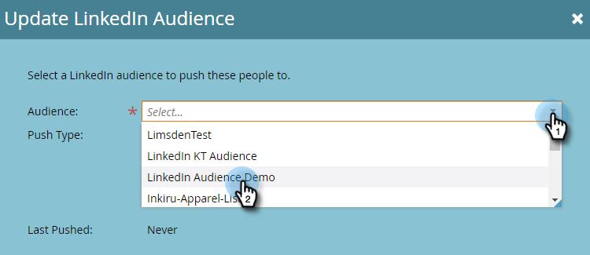
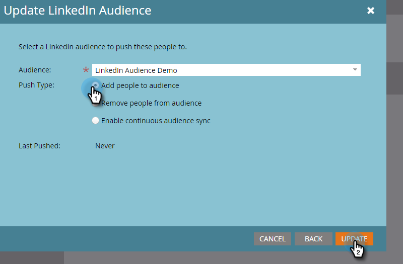
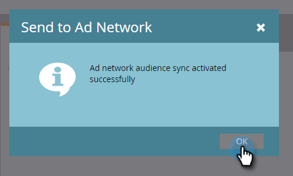

# Send a List to an Ad Network {#send-a-list-to-an-ad-network}

Learn how to send a Static List to LinkedIn, Facebook, or Google.

## How to Send a List {#how-to-send-a-list}

1. In Marketo, select your list, click the **List Actions** drop-down, and select **Send to Ad Network**.

   

1. Choose between LinkedIn, Facebook, or Google (the other options are not available at this time). In this example, we're choosing **LinkedIn**. Click **Next**.

   

1. Click the Audience drop-down and select your desired audience.

   

   >[!TIP]
   >
   >If you ever need to check, you can see the destination audience that a list is being synced to via the Status tab.

1. Choose your desired Push Type and click **Update**.

   

   >[!NOTE]
   >
   >If you select "Enable continuous audience sync," Marketo keeps the list up-to-date in the chosen Ad Network as the list changes in your Marketo instance. We both add **and** remove people from the audience if they’re added to/removed from the static list.

1. And that's it! Click **OK** to exit.

   

## FAQ {#faq}

**Can a single static list be synced with multiple ad audiences?**

No, a list can only be synced to a single destination audience.

**If I enable continuous sync to an existing ad audience, will the existing audience get replaced?**

No, the existing audience will be added to, not replaced.
