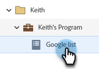
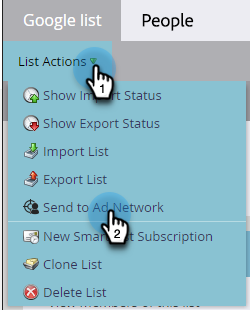
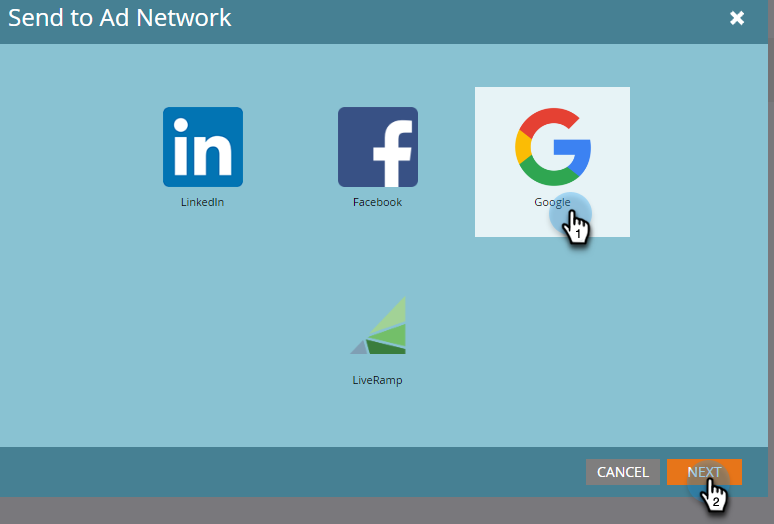
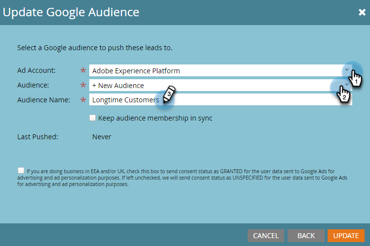
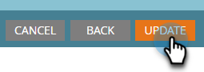
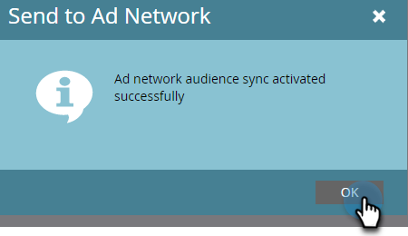

# Send a List to Google {#send-a-list-to-google}

Follow the steps below to send a static list to your Google account.

1. In Marketo Engage, find and select the desired list.

   

1. Click the **List Actions** drop-down and select **Send to Ad Network**.

   

1. Choose Google and click **Next**.

   

1. Choose your desired Ad Account. You can choose an existing audience or create a new one. In this example, we're creating a new one. Give your new audience a name.

   

1. Make your optional selections. 

   

   >[!NOTE]
   >
   >* Selecting **Keep audience membership in sync** keeps the list up-to-date as it changes in your instance. We add/remove people from the audience when they're added to/removed from the static list.
   >
   >* Selecting the checkbox at the bottom sends the consent status as GRANTED for user data sent to Google Ads for advertising and ad personalization purposes. Leaving it unchecked sends the consent status as UNSPECIFIED.

1. Click **Update**.

   

1. Click **OK** to exit.

   
