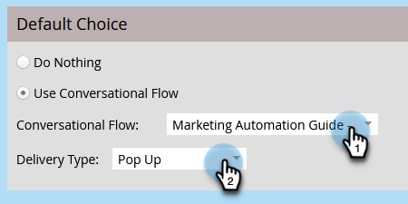
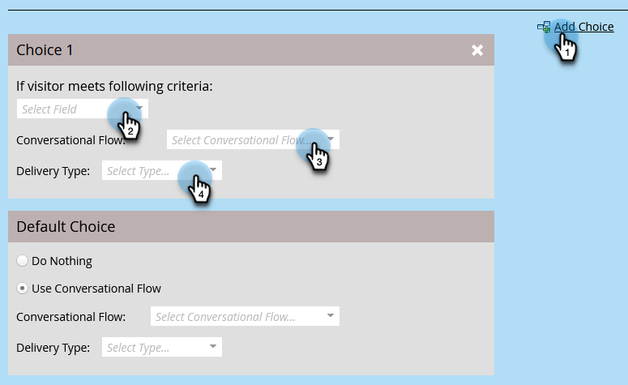

# Conversational Flow Settings For Marketo Engage Forms{#conversational-flow-settings-for-marketo-engage-forms}

Make Marketo Engage Forms conversational by integrating them with Dynamic Chat Conversational Flows. Instantly qualify leads using form data or Smart List membership for meeting bookings, white paper links, or custom goals.

>[!PREREQUISITES]
>
>ADD PREREQ HERE

1. Find and select your form (or create a new one).

   

1. Click **Edit Draft**.

   

1. On the form edit page, click **Form Settings**, then **Settings**.

   

1. Click the **Conversational Flow Settings** slider to enable.

   

1. A Default Choice modal will appear. Select your preference. In this example we're choosing **Use Conversational Flow**.

   

1. Select the desired Conversational Flow and Delivery Type.

   

   >[!NOTE]
   >
   >[Learn more about Conversational Flows](/help/marketo/product-docs/demand-generation/dynamic-chat-two/automated-chat/conversational-flows-overview.md){target="_blank"}

   **OPTIONAL STEP**: You can click Add Choice to target chat visitors that meet a specific criteria. 

   
   
   >[!IMPORTANT]
   >
   >The visitor's browser must be cookie'd as a known person prior to form submission in order to qualify for member of Static/Smart List.

1. Click **Finish** when done.

   
