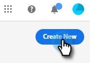
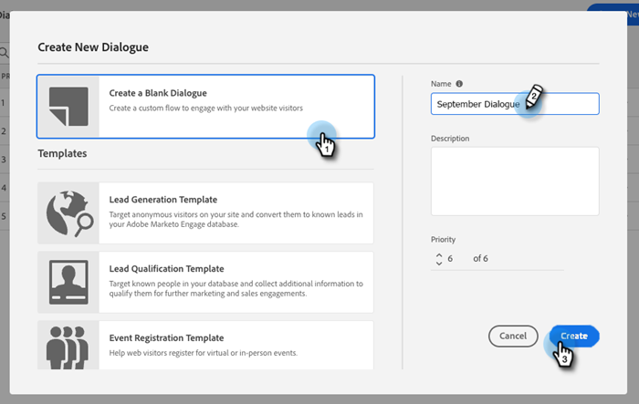

# Create a Dialogue {#create-a-dialogue}

Here's how to create a new dialogue.

1. Click **Dialogues**.

   

1. Click the **Create New** button.

   

1. Choose a blank Dialogue, or one of the pre-populated templates. Enter a name (description is optional), change the priority level (optional), and click **Create**.

   

>[!NOTE]
>
>Priority determines which Dialogue will be shown to a visitor when they qualify for multiple Dialogues simultaneously.

>[!MORELIKETHIS]
>
>* [Audience Criteria](/help/marketo/product-docs/demand-generation/dynamic-chat/dialogues/audience-criteria.md){target="_blank"}
>* [Stream Designer](/help/marketo/product-docs/demand-generation/dynamic-chat/dialogues/stream-designer.md){target="_blank"}
>* [Reports](/help/marketo/product-docs/demand-generation/dynamic-chat/dialogues/reports.md){target="_blank"}

