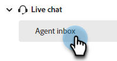

# Agent Inbox {#agent-inbox}

Agents will field live chats within the Agent Inbox. In addition to the active conversations, they can see past conversations, visitor information, and more.

   

## Availability Toggle {#availability-toggle}

On the upper-right side of the Agent Inbox screen, you have the option to set your status as available or unavailable. 

   

>[!IMPORTANT]
>
>**This will override** the [live chat availability](/help/marketo/product-docs/demand-generation/dynamic-chat-two/setup-and-configuration/agent-settings.md#live-chat-availability) you established in Agent Settings. The status will remain until either you switch it back, or to the next block of time in your availability. 

## Accepting a Live Chat {#accepting-a-live-chat}

When a live chat is routed to the agent, they'll see a blue banner across the top of the screen asking them to accept.

   

### Things to Note {things-to-note}

* Agents have 45 seconds to respond before the "Accept chat" message times out.
* BROWSER TIDBIT
* There is a limit of 10 live chats per agent at this time

## Conversations {#conversations}

On the left side of the Agent Inbox screen, you can choose to display only the active conversations, or all of them.

   

## Visitor Information {#visitor-information}

On the right side of the Agent Inbox screen, you'll be able to see (from top to bottom) their: name, job title, email address, phone number, and CRM status. Any information not passed along will be displayed as a dash (-).

   

## Activity History {#activity-history}

Below the visitor information is activity history. View activity types and dates, and even view chat transcripts.

   

>[!NOTE]
>
>Information is displayed for the past 90 days only. 

Active conversations-
All conversations-
Calendar sharing
Visitor information-
Recent Dynamic Chat activities
