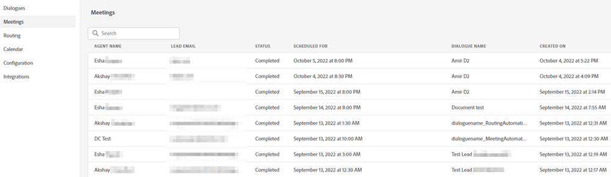

# Meeting List {#meeting-list}

This is where you'll see all of the appointments that have been scheduled by website visitors through your various Dialogues. Here you'll find the email address of the person that booked the appointment, which agent they booked the appointment with, when the appointment is scheduled to occur, and whether the scheduled meeting time has passed or not.

   

>[!NOTE]
>
>When a meeting is booked on an agent's calendar, the agent will receive an email notification about the booking, including detailed information about the visitor's Dynamic Chat engagement.
