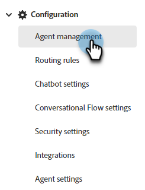
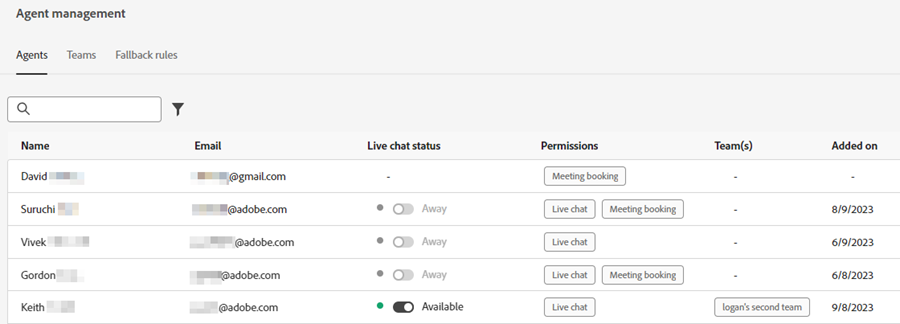

# Agent Management {#agent-management}

In Agent Management, view a list of agents in your Dynamic Chat instance, manage teams, and set your fallback rules.

   

## Agents {#agents}

This tab lists all of the agents in your Dynamic Chat instance, and includes such information as their name, email address, live chat status, and more.

   

## Teams {#teams}

Admins can create teams of agents to facilitate ease of routing to specific groups of sales agents.

   

### Create a Team {#create-a-team}

1. Click **+ Create Team**.

   

1. Give your team a name.

   

1. Click the **Add Agents** drop-down and select the desired agents.

   

1. Click **Create**.

   

## Fallback Rules {#fallback-rules}

### Meeting Fallback {#meeting-fallback}

Select a standard (system) message or write a custom one for visitors to see when meeting booking is unavailable.

   

### Live Chat Fallback {#live-chat-fallback}

Select a standard (system) message or write a custom one for visitors to see when Live Chat is unavailable.

   

>[!NOTE]
>
>Selecting the **Include Meeting Booking Option** checkbox will give the chat visitor the option to book a meeting when no agents are available to live chat.

>[!TIP]
>
>When creating a custom message, you can style the font, use links, even insert emojis! `:)`
