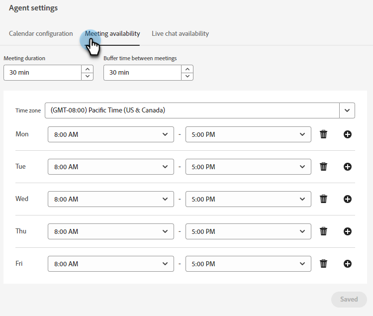
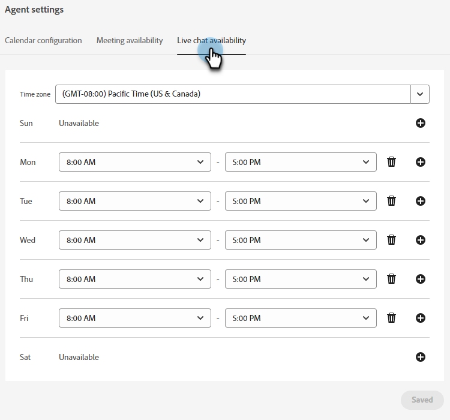

# Agent Settings {#agent-settings}

Configure your calendar and set meeting/live chat availability.

   

## Connect Calendar {#connect-calendar}

In the Calendar configuration tab, connect your Outlook or Gmail calendar for use in appointment scheduling in the chatbot.

   

Once a user's calendar is connected to Dynamic Chat, they'll be added to the queue and their calendar will be available for website visitors to schedule appointments on.

>[!NOTE]
>
>You can connect one calendar per user. If you want to receive meetings on multiple calendars, you must add multiple users and have them each connect their calendars.

Users can also customize the body of the invite that's sent to the visitor when they schedule an appointment on the user's calendar. They can also select the checkbox at the bottom to include a Google Meet or Microsoft Teams link (depending on which calendar was connected).

   

>[!TIP]
>
>Use the token icon (curly brackets) to personalize your meeting booking confirmation emails using person or company attributes.

### Permissions {#permissions}

Configuring with Outlook grants the following permissions to Dynamic Chat:

* Full access to your calendars
* Sign you in and read your profile
* Maintain access to data you've given it access to
* Read your mailbox settings

Configuring with Google grants the following permissions to Dynamic Chat:

* Create, change, or delete calendars
* Update individual calendar events
* Change your settings, including who can see your events
* Change who the calendar is shared with
* Access to your name, email address, language preference, and profile picture

## Meeting Booking Availability {#meeting-booking-availability}

Set your time zone and time/day of week availabilty to receive meeting bookings.

   

<table> 
 <tbody> 
  <tr> 
   <td><b>Meeting duration</b></td>
   <td>Maximum meeting length. - WHAT HAPPENS? AUTO ENDING?</td>
  </tr> 
  <tr> 
   <td><b>Buffer time between meetings</b></td>
   <td>Amount of time you set as a buffer for after the meeting. If you set it for 30 minutes, no one will be able to book a meeting with you until 31 minutes after the scheduled end of a meeting on your calendar. - 31 or 30???????????</td>
  </tr>
 </tbody> 
</table>

>[!TIP]
>
>You can select multiple blocks of time on the same day (e.g., Friday from 8a-12p _and_ 1p-5p) by clicking the **+** sign on the right.

## Live Chat Availability {#live-chat-availability}

Set your time zone and time/day of week availabilty to receive live chats.

   

If you're logged in to the app, you'll receive an in-app notification of an incoming chat. If you're not logged in, you'll receive a browser notification.

>[!IMPORTANT]
>
>The [availability toggle](/help/marketo/product-docs/demand-generation/dynamic-chat-two/live-chat/agent-inbox.md#availability-toggle){target="_blank"} in the Agent Inbox **will override** what you enter in the Live Chat Availability tab. So if you're scheduled as available from 1p-5p but need to take a quick break at 3p, you don't need to alter your agent settings. Availability toggle status will remain until you manually switch it, or until the next block of time in your availability is reached.

>[!TIP]
>
>You can select multiple blocks of time on the same day (e.g., Friday from 8a-12p _and_ 1p-5p) by clicking the **+** sign on the right.
