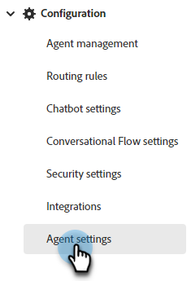

# Agent Settings {#agent-settings}

In the Calendar configuration tab, connect your Outlook or Gmail calendar for use in appointment scheduling in the chatbot.

## Connect Calendar {#connect-calendar}

   

Once a user's calendar is connected to Dynamic Chat, they'll be added to the queue and their calendar will be available for website visitors to schedule appointments on.

>[!NOTE]
>
>You can connect one calendar per user. If you want to receive meetings on multiple calendars, you must add multiple users and have them each connect their calendars.

Users can also customize the body of the invite that's sent to the visitor when they schedule an appointment on the user's calendar. They can also select the checkbox at the bottom to include a Google Meet or Microsoft Teams link (depending on which calendar was connected).

   

>[!TIP]
>
>Use the token icon (curly brackets) to personalize your meeting booking confirmation emails using person or company attributes.

### Permissions {#permissions}

Configuring with Outlook grants the following permissions to Dynamic Chat:

* Full access to your calendars
* Sign you in and read your profile
* Maintain access to data you've given it access to
* Read your mailbox settings

Configuring with Google grants the following permissions to Dynamic Chat:

* Create, change, or delete calendars
* Update individual calendar events
* Change your settings, including who can see your events
* Change who the calendar is shared with
* Access to your name, email address, language preference, and profile picture

## Meeting Booking Availability {#meeting-booking-availability}

Text

## Meeting Length and Buffer Time {#meeting-length-and-buffer-time}

Text

## Live Chat Availability {#live-chat-availability}

Text
