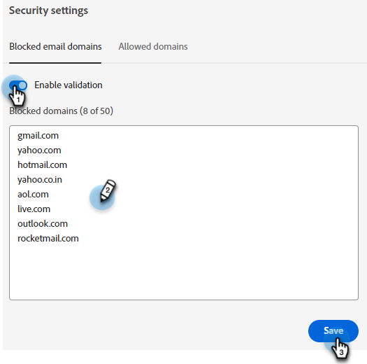

# Security Settings {#security-settings}

In Security settings, you have the ability to add domains to a blocked or allowed list.

   

## Blocked Email Domains {#blocked-email-domains}

1. Select the **Enable Validation** slider to activate your blocklist. Enter up to 50 domains and click **Save**.

   

## Allowed Domains {#allowed-domains}

1. Select the **Enable Validation** slider to activate your allowlist. Enter the allowed domains and click **Save**.

   
