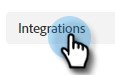

# Access Dynamic Chat {#access-dynamic-chat}

After you've completed the [initial setup](/help/marketo/product-docs/demand-generation/dynamic-chat/initial-setup.md), it's time to sync Dynamic Chat to your Marketo subscription.

1. In My Marketo, click the **Dynamic Chat** tile.

   

   >[!NOTE]
   >
   >If you don't see the tile, reach out to your Marketo Admin.

1. If you've previously accessed an application with an Adobe ID, you'll be taken straight to Dynamic Chat. If not, [set up your Adobe ID](https://helpx.adobe.com/manage-account/using/create-update-adobe-id.html).

   PICC (screenshot when left nav is fixed)

1. To connect your Marketo instance, select **Integrations**.

   

1. Click ?INSERT TEXT HERE?.

   PICC (screenshot when I get brand new sub)

   >[!NOTE]
   >
   >It can take anywhere from 5 minutes to 8 hours for the sync to complete, depending on the size of your database. The average sync time is 60 minutes. VERIFY TIME FRAME

RELATED ARTICLES
