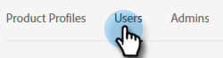
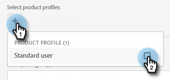
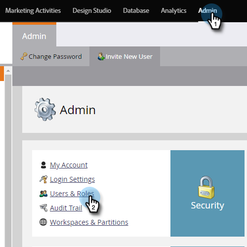

# Add or Remove Chat Users {#add-or-remove-chat-users}

Follow the steps below to add or remove chat users.

## Add a Chat User {#add-a-chat-user}

1. Log in to the [Adobe Admin Console](https://adminconsole.adobe.com/).

   

1. Click **[!UICONTROL Dynamic Chat]**.

   

   >[!NOTE]
   >
   >If you have more than one Marketo subscription, select the desired one prior to the next step.

1. Click the **[!UICONTROL Users]** tab.

   

1. Click the **[!UICONTROL Add User]** button.

   

1. Enter the [!UICONTROL name, user group, or email address] of the user you'd like to add. First and last name are optional.

   

1. Click the **+** icon and select the desired product profile.

   

1. Click **[!UICONTROL Save]**.

   

## Add [!DNL Dynamic Chat] Access to Marketo Role {#add-dynamic-chat-access-to-marketo-role}

If the newly added Chat user's Marketo role doesn't already have [!DNL Dynamic Chat] permission, here's how to add it.

1. In Marketo, click **[!UICONTROL Admin]** and select **[!UICONTROL Users & Roles]**.

   

1. Click the **[!UICONTROL Roles]** tab.

   

1. From the list, select the role you want to modify and click **[!UICONTROL Edit Role]**.

   

1. Select **[!UICONTROL Access Dynamic Chat]** and click **[!UICONTROL Save]**.

   

## Remove a Chat User {#remove-a-chat-user}

1. Log in to the [Adobe Admin Console](https://adminconsole.adobe.com/).

   

1. Click **[!UICONTROL Dynamic Chat]**.

   

   >[!NOTE]
   >
   >If you have more than one Marketo subscription, select the desired one prior to the next step).

1. Click the **[!UICONTROL Users]** tab.

   

1. Select the user you want to remove.

   

1. Click the **[!UICONTROL Remove User]** button.

   

1. Click **[!UICONTROL Remove User]** to confirm.

   

>[!MORELIKETHIS]
>
>* [Adobe Admin Console Users](https://helpx.adobe.com/enterprise/using/users.html)
>* [Manage Users Individually](https://helpx.adobe.com/enterprise/using/manage-users-individually.html)
