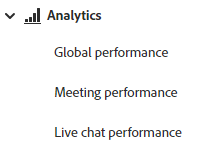
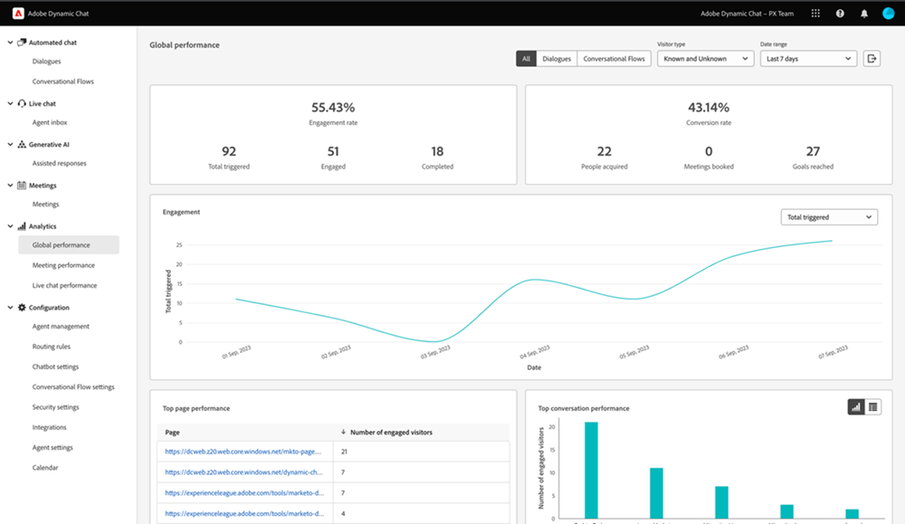
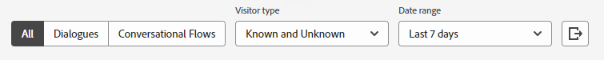
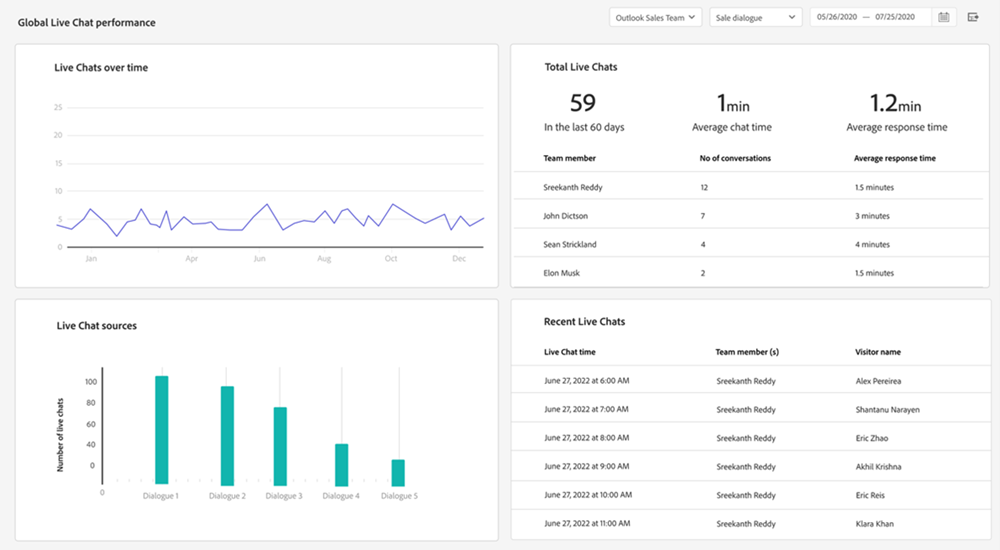
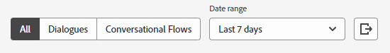

# Analytics {#analytics}

While reporting is available at dialogue level, check overall engagement using the three dashboards below. 

Access each dashboard under **Analytics** in the left nav.

## Global Performance Dashboard {#global-performance-dashboard}

See how well your Dialogues are performing, including engagement and performance metrics (total and over a time), top performing pages, and top performing Dialogues.

View Dialogues, Conversational Flows, or all. Sort by known visitors, unknown visitors, or both. Select a preset or custom date range. Export your results via the click of a button.

## Meeting Performance Dashboard {#meeting-performance-dashboard}

See how many meetings are being booked and who they're being booked with.

View Dialogues, Conversational Flows, or all. Select a preset or custom date range. Export your results via the click of a button.

## Live Chat Performance Dashboard {#live-chat-performance-dashboard}

View how many conversations your live sales agents had and which teams are performing the best.

View Dialogues, Conversational Flows, or all. Select a preset or custom date range. Export your results with the click of a button.

