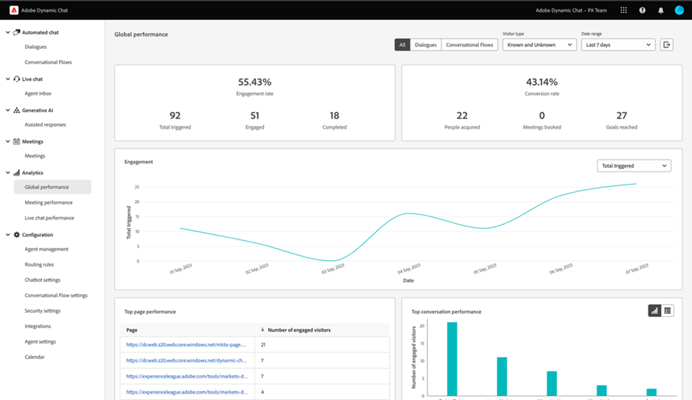
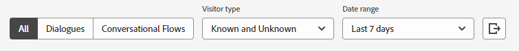
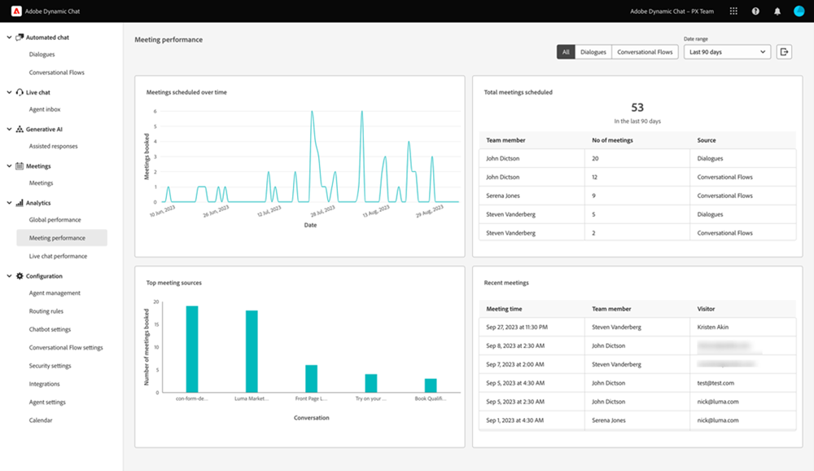
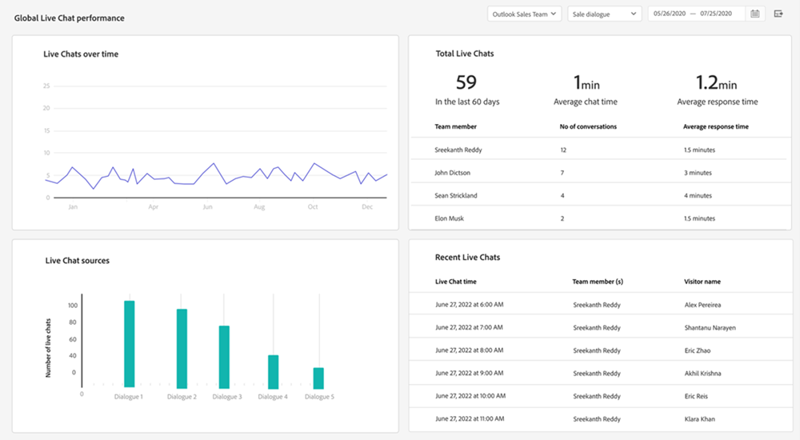
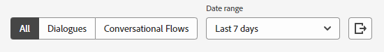

# Analytics {#analytics}

While reporting is available at dialogue level, check overall engagement using the three dashboards below.

>[!NOTE]
>
>Data from Dynamic Chat can take up to 24 hours to reflect in your Marketo Engage instance.

Access each dashboard under **Analytics** in the left nav.

## Global Performance Dashboard {#global-performance-dashboard}

See how well your Dialogues are performing, including engagement and performance metrics (total and over a time), top performing pages, and top performing Dialogues.

View Dialogues, Conversational Flows, or all. Sort by known visitors, unknown visitors, or both. Select a preset or custom date range. Export your results via the click of a button.

## Meeting Performance Dashboard {#meeting-performance-dashboard}

See how many meetings are being booked and who they're being booked with.

View Dialogues, Conversational Flows, or all. Select a preset or custom date range. Export your results via the click of a button.

## Live Chat Performance Dashboard {#live-chat-performance-dashboard}

View how many conversations your live sales agents had and which teams are performing the best.

View Dialogues, Conversational Flows, or all. Select a preset or custom date range. Export your results with the click of a button.

## Definitions {#definitions}

<table>
<thead>
<tbody>
  <tr>
    <td style="width:30%"><b>Completed</b></td>
    <td>A completed event occurs when a visitor reaches the last prompt in a conversation <i>or</i> when a visitor exhausts all the content in a conversation.
     One completed event per visitor, per session.</td>
  </tr>
  <tr>
    <td style="width:30%"><b>People Acquired</b></td>
    <td>Happens when a visitor submits their email address.
     One acquisition per visitor, per session.</td>
  </tr>
  <tr>
    <td style="width:30%"><b>Engagement Rate</b></td>
    <td>Number of users responded (first input by user)/number of triggers (chatbot displayed).</td>
  </tr>
  <tr>
    <td style="width:30%"><b>Conversion Rate</b></td>
    <td>User acquired (new emails captured)/user engaged.</td>
  </tr>
</tbody>
</table>
