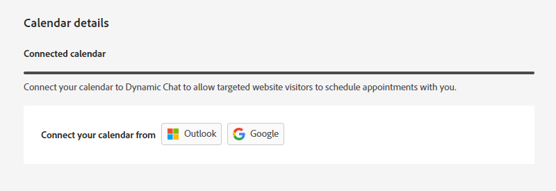
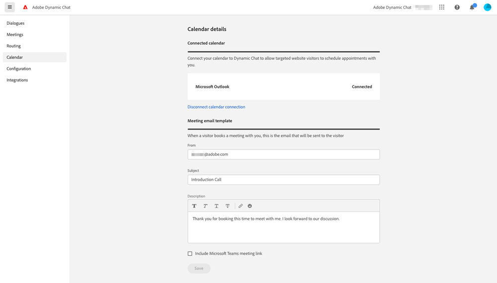

# Calendar {#calendar}

In the [!UICONTROL Calendar] tab, connect your [!DNL Outlook] or [!DNL Gmail] calendar for use in appointment scheduling in the chatbot.

   

Once a user's calendar is connected to [!DNL Dynamic Chat], they'll be added to the queue and their calendar will be available for website visitors to schedule appointments on.

Users can also customize the body of the invite that's sent to the visitor when they schedule an appointment on the user's calendar. They can also select the checkbox at the bottom to include a [!DNL Google Meet] or Microsoft Teams link (depending on which calendar was connected).

   
