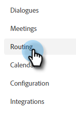
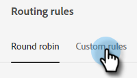

# Routing {#routing}

Meetings booked in [!DNL Dynamic Chat] can be routed two ways. Round robin, or using a custom rule.

Round robin: Meetings get assigned to agents sequentially. So if you have five agents and agent three took the last meeting, agent four will get the next one, followed by agent five, then back to agent one.

Custom rule: You can choose specific agents to receive meetings based on attributes you select.

## Create a Custom Rule {#create-a-custom-rule}

In this example we're sending all meetings from the inferred states of CA, OR, and WA to agent John.

1. In [!DNL Dynamic Chat], select **[!UICONTROL Routing]**.

   

1. Click the **[!UICONTROL Custom rules]** tab.

   

1. Click **[!UICONTROL Create rule]**.

   

1. Give your rule a name and click **[!UICONTROL Next]**.

   

1. Choose your desired agent(s).

   

1. Drag over your desired attribute(s).

   

1. Find and select your desired value(s).

   

1. When all of your desired values are selected, click **[!UICONTROL Save]**.

   
