# Audience Criteria {#audience-criteria}

Similar to Marketo Engage Smart Lists, Audience Criteria attributes allow you to define your target audience. You can target known or unknown people using inferred, person, or company attributes (or a combination thereof).

## Priority {#priority}

Priority determines which Dialogue a lead receives in the case they qualify for more than one. It's established when you first [create your Dialogue](/help/marketo/product-docs/demand-generation/dynamic-chat/automated-chat/create-a-dialogue.md){target="_blank"}. You can change the priority for an exisiting Dialogue by opening it and going to **Dialogue Details** in the Audience Criteria tab.

   

## Events {#events}

Events allow you to target visitors based on how much they scroll or how long they're on your page/site. In the example below, we're targeting visitors who have been on a specific page for more than 20 seconds.

1. Grab the **Time on Page** event and drag it to the right.

   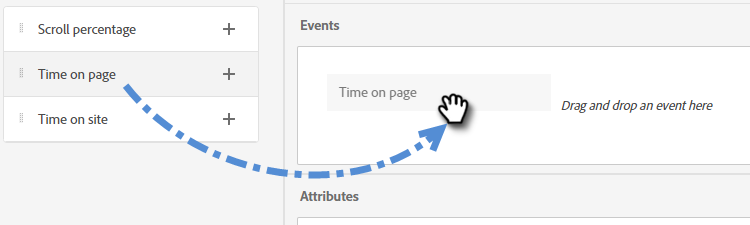

1. Set the "Greater Than" time to 20 seconds.

   

1. Add the URL of the desired page in the [Target](#target) section.

   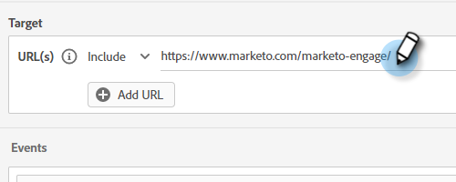

## Attributes {#attributes}

**Known People**

There are _many_ attribute combinations to choose from. In the example below, we're targeting all **known people** in California who work at a company with more than 50 employees.

1. Grab the **Person State** attribute and drag it to the right.

   

1. _Is_ is set by default. In the Select Values field, type in CA (you can also click the drop-down and select from the list).

   

1. Grab the **Company Size** attribute and drag it to where it says _drag and drop an attribute here_.

   

   >[!NOTE]
   >
   >You can also choose an attribute by clicking its **+** icon.

1. Click the operator drop-down and select **Greater Than**.

   

1. Type 50 and click elsewhere on the screen to save.

   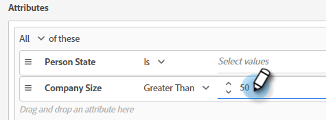

And that's it!

**Anonymous People**

There's an easy way to specifically target people who are not in your database yet. In this example, we're targeting all **anonymous people** located in the New York area.

1. Grab the **Person Email** attribute and drag it to the right.

   

1. Click the operator drop-down and select **Is Empty**.

   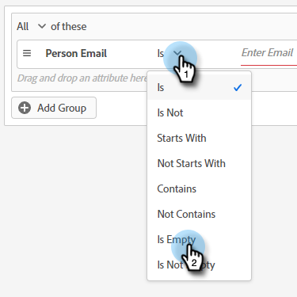

1. Grab the **Inferred State** attribute and drag it to where it says _drag and drop an attribute here_.

   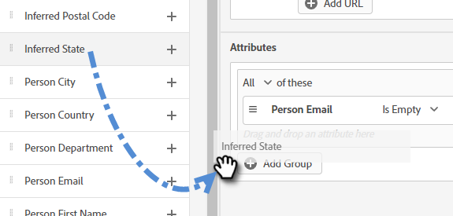

   >[!NOTE]
   >
   >When someone visits your website, [Munchkin](/help/marketo/product-docs/administration/additional-integrations/add-munchkin-tracking-code-to-your-website.md){target="_blank"} cookies them and puts them into the system. We look up their IP in a special database and infer all kinds of good info.

1. _Is_ is set by default. In the Select Values field, type in NY (you can also click the drop-down and select from the list).

   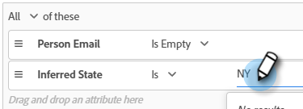

## Membership {#membership}

Use Marketo Engage Smart Lists for your Dialogue's target audience.

>[!AVAILABILITY]
>
>Member of Smart List or Member of List criteria requires Dynamic Chat Prime. Please contact the Adobe Account Team (your Account Manager) for details.

1. Under Membership, grab **Member of Smart List** and drop it onto the canvas.

   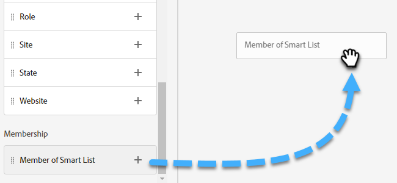

1. Select your desired Smart List.

   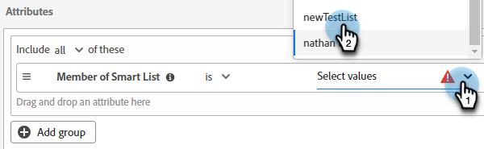

## Add Groups {#add-groups}

You have the option of grouping attributes as well, in case you want to have all of certain attributes along with "all or any" of another. You can add multiple groups.

   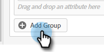

   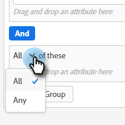

## Target {#target}

This is where you enter the URL(s) that you want a specific Dialogue to be shown on. You also have the option of adding exclusions.

Acceptable formats:

* `http://website.com`
* `https://*.website.com`
* `http://website.com/folder/*`
* `https://*.website.com/folder/*`

>[!NOTE]
>
>Using an asterisk acts as a catch-all wilcard. So `https://*.website.com` would put the dialogue on every page of the site, including subdomains (ex: `support.website.com`). And `https://website.com/folder/*` would put the dialogue on every HTML page in the subsequent folder (ex: in this case let's say the folder is "sports," so: website.com/sports/baseball.html, website.com/sports/football.html, etc.).

**Exclusions**

Use exclusions to ensure your Dialogue does **not** appear on a specific page/area of your site. Exclusions follow the same format as inclusions.

   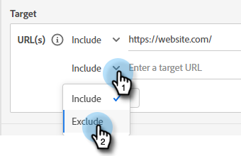

>[!MORELIKETHIS]
>
>* [Create a Dialogue](/help/marketo/product-docs/demand-generation/dynamic-chat/automated-chat/create-a-dialogue.md){target="_blank"}
>* [Stream Designer](/help/marketo/product-docs/demand-generation/dynamic-chat/automated-chat/stream-designer.md){target="_blank"}
