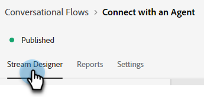
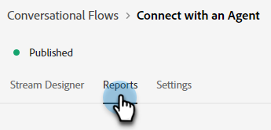
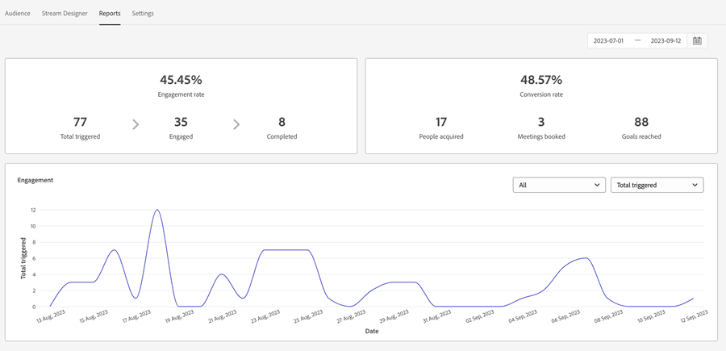
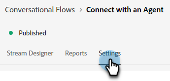
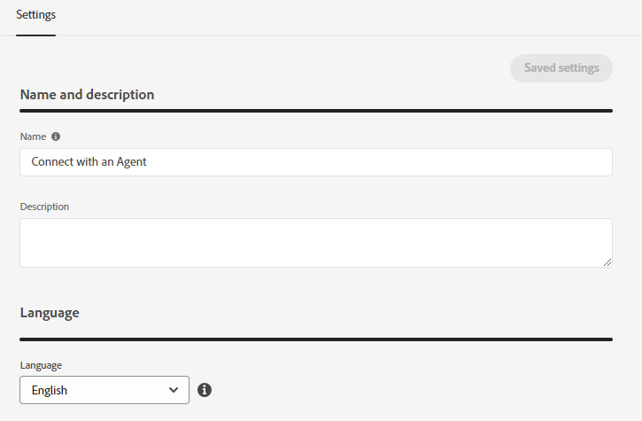
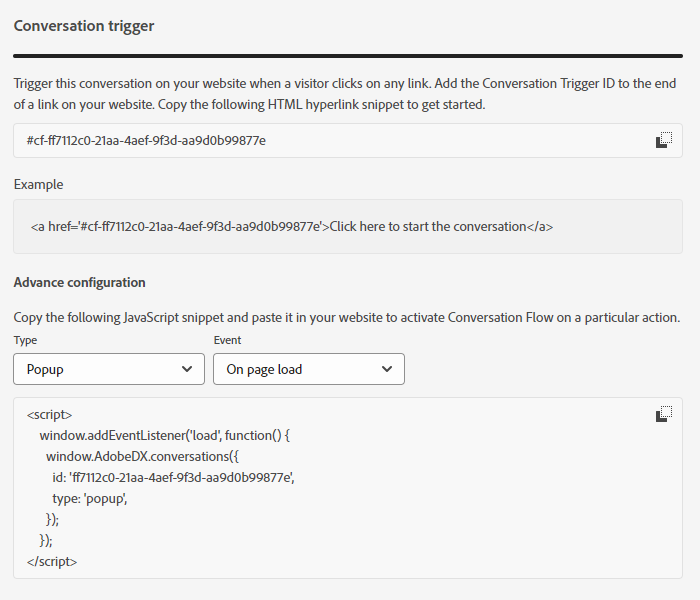

# Conversational Flow Overview {#conversational-flow-overview}

Design a Conversational Flow and trigger it to any visitor based on a specific action (e.g., clicking on a call-to-action button, upon page load, time spent on page, etc.).

   

## Dialogues vs. Conversational Flows {#dialogues-vs-conversational-flows}

While Dialogues and Conversational Flows have several similarities, they are two separate features.

<table> 
 <tbody> 
  <tr> 
   <th style="width:50%">Dialogues</th> 
   <th style="width:50%">Conversational Flows</th>
  </tr> 
  <tr> 
   <td>Dialogues are targeted&mdash;You design a conversation for a specific page and audience based on parameters you implemented.</td> 
   <td>Conversational Flows are triggered&mdash;You design a conversation that can be triggered based on a visitor's action, like filling out a form, clicking a link, etc.</td>
  </tr>
   <tr> 
   <td>Only supported in the Chatbot interface.</td> 
   <td>Currently supported in a pop-up interface, with more interfaces planned.</td>
  </tr>
  </tr>
   <tr> 
   <td>Multiple Dialogues can be created for the same segment of leads, with a priority order so each visitor sees the Dialogue in sequence by priority as they continue to engage.</td> 
   <td>Conversational Flows have no priority order and can be triggered any number of times by the same lead based on the call-to-action determined.</td>
  </tr>
  <tr>
   <td>Chatbot conversations are powered by Dialogues.</td>
   <td><a href="/help/marketo/product-docs/demand-generation/dynamic-chat/automated-chat/conversational-flow-settings-for-marketo-engage-forms.md" target="_blank">Conversational Forms</a> in Marketo Engage are powered by Conversational Flows.</td>
  </tr>
 </tbody> 
</table>

## Stream Designer Tab {#stream-designer-tab}

The Stream Designer for Conversational Flows is nearly identical to the one for Dialogues. [Learn all about it here](/help/marketo/product-docs/demand-generation/dynamic-chat/automated-chat/stream-designer.md){target="_blank"}.

   

## Reports Tab {#reports-tab}

The Reports tab is where you'll be able to see metrics around how well your Conversational Flow is performing.

   

View engagement rate, conversion rate, filter by known and/or unknown visitors, and more.

   

## Settings Tab {#settings-tab}

   

In the top half of the Settings tab, you can update the Conversational Flow's name, add an optional description, and change the language.

   

>[!NOTE]
>
>Selecting a different language changes the language of the system text only. You are responsible for translating content.

### Conversations SDK {#conversations-sdk}

In the bottom half of the Settings tab, customize the Conversation trigger, also known as Conversations SDK. You can decide if the conversation is triggered on your website when a visitor clicks any link, or upon page load.

   

>[!TIP]
>
>See [Conversations SDK](https://experienceleague.adobe.com/tools/marketo-dynamic-chatbot/conversations-sdk/){target="_blank"} in action!

>[!MORELIKETHIS]
>
>[Create a Conversational Flow](/help/marketo/product-docs/demand-generation/dynamic-chat/automated-chat/create-a-conversational-flow.md){target="_blank"}
