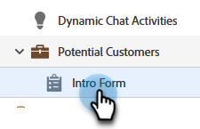
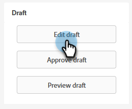
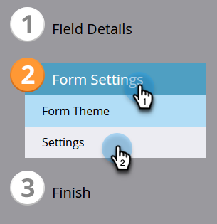
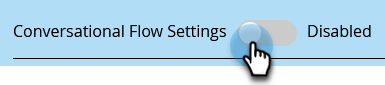
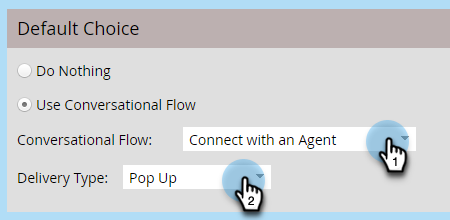
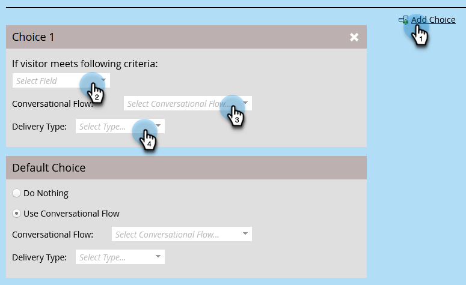
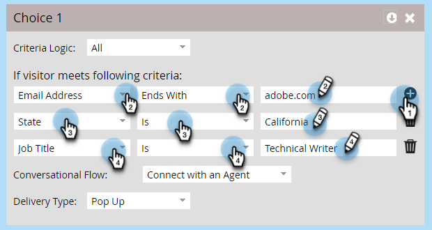
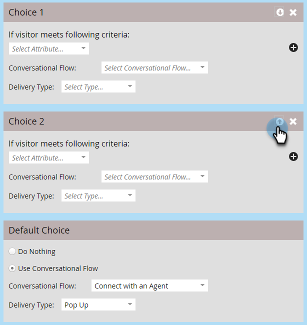
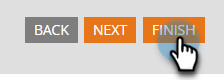

# Conversational Flow Settings For Marketo Engage Forms{#conversational-flow-settings-for-marketo-engage-forms}

Make Marketo Engage Forms conversational by integrating them with Dynamic Chat Conversational Flows. Instantly qualify leads using form data or Smart List membership for meeting bookings, white paper links, or custom goals.

>[!AVAILABILITY]
>
>Member of Smart List or Member of List criteria requires Dynamic Chat Prime. Please contact the Adobe Account Team (your Account Manager) for details.

1. Find and select your form (or create a new one).

   

1. Click **[!UICONTROL Edit Draft]**.

   

1. On the form edit page, click **[!UICONTROL Form Settings]**, then **[!UICONTROL Settings]**.

   

1. Click the **[!UICONTROL Conversational Flow Settings]** slider to enable.

   

1. A Default Choice modal will appear. Select your preference. In this example we're choosing **[!UICONTROL Use Conversational Flow]**.

   

1. Select the desired **[!UICONTROL Conversational Flow]** and **[!UICONTROL Delivery Type]**.

   

   >[!NOTE]
   >
   >[Learn more about Conversational Flows](/help/marketo/product-docs/demand-generation/dynamic-chat/automated-chat/conversational-flow-overview.md){target="_blank"}

   **OPTIONAL STEP**: You can click **[!UICONTROL Add Choice]** to target chat visitors that meet a specific criteria. You can add up to nine choices for a total of ten.

   
   
   >[!NOTE]
   >
   >The visitor's browser must be cookie'd as a known person prior to form submission in order to qualify for member of Static/Smart List.

   **OPTIONAL STEP**: Click the **+** sign within each step to add more attributes, allowing you to narrow your targeted audience (the attributes available are the fields you've chosen for the form). In this example, we're targeting Adobe Technical Writers in California.

   

   >[!NOTE]
   >
   >Criteria Logic set to "all" means every attribute must be met in order to qualify. Criteria Logic set to "any" means any one of the attributes will suffice.

   **OPTIONAL STEP**: If you add two or more choices, you can reorder them by clicking their up/down arrows.

   

1. Click **[!UICONTROL Finish]** when done.

   
