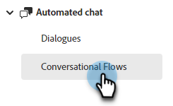
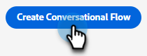

# Create a Conversational Flow {#create-a-conversational-flow}

Here's how to create a new Conversational Flow.

1. Under Automated Chat, click **Conversational Flows**.

   

1. Click **Create Conversational Flow**.

   

1. Choose a blank Conversational Flow, or one of the pre-populated templates. Enter a name (description is optional), change the language (optional), and click **Create**.

   

>[!NOTE]
>
>This will change the language of the system text only. You are responsible for translating content.

1. Just like in Dialogues, at this point it's time to [create a stream](/help/marketo/product-docs/demand-generation/dynamic-chat/automated-chat/stream-designer.md#create-a-stream){target="_blank"}.

>[!MORELIKETHIS]
>
>[Conversational Flow Overview](/help/marketo/product-docs/demand-generation/dynamic-chat/automated-chat/conversational-flow-overview.md){target="_blank"}
