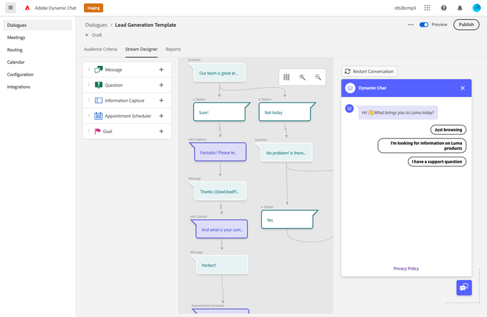
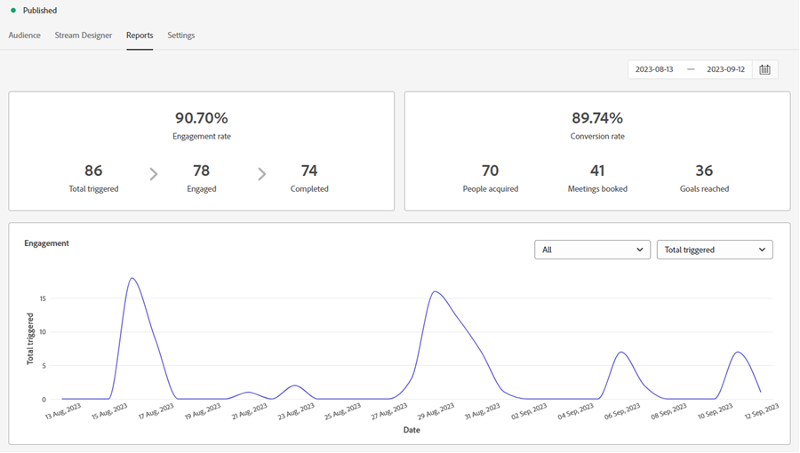
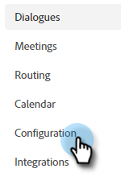

# Dialogue Overview {#dialogue-overview}

Dialogues are individual chat conversations. In each Dialogue, you decide where the specific chat conversation is displayed, to whom it will be shown, and what the content of the conversation will be. Each Dialogue also has its own report page where you can monitor effectiveness.

## Audience Criteria {#audience-criteria}

The [Audience Criteria](/help/marketo/product-docs/demand-generation/dynamic-chat/automated-chat/audience-criteria.md){target="_blank"} section of a Dialogue is where you'll define where and to whom your chat conversation will be shown

   
   
## Stream Designer {#stream-designer}

The [Stream Designer](/help/marketo/product-docs/demand-generation/dynamic-chat/automated-chat/stream-designer.md){target="_blank"} section of a Dialogue is where you'll design the conversation that you want to have with your website visitors.

   

## Reports {#reports}

The Reports tab is where you'll be able to see metrics around how well your Dialogue is performing.

   

<table>
 <tr>
  <td><strong>Total Triggered</strong></td>
  <td>Increments every time a visitor qualifies for/is shown a Dialogue.
</td>
 </tr>
 <tr>
  <td><strong>Engaged</strong></td>
  <td>Increments when a visitor interacts with at least one card in a Dialogue (e.g., Question, Info Capture, etc.)</td>
 </tr>
 <tr>
  <td><strong>Completed</strong></td>
  <td>Increments every time a visitor reaches the end of any branch in a Dialogue.</td>
 </tr>
 <tr>
  <td><strong>People Acquired</strong></td>
  <td>Increments every time a visitor provides a valid email address in a Dialogue flow.</td>
 </tr>
 <tr>
  <td><strong>Meetings Booked</strong></td>
  <td>Increments every time a visitor successfully schedules an appointment via the chatbot.</td>
 </tr>
 <tr>
  <td><strong>Goals Reached</strong></td>
  <td>Increments every time a visitor reaches a goal in any Dialogue flow.</td>
 </tr>
</table>

## Disable/Enable all Dialogues {#disable-enable-all-dialogues}

You have the ability to disable (and re-enable) all published Dialogues at the same time.

1. In Dynamic Chat, click the **Configuration** tab.

   

1. Toggle the **Chat Enabled** switch to off to disable (and back on to re-enable) all Dialogues.

   
