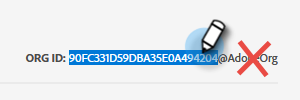
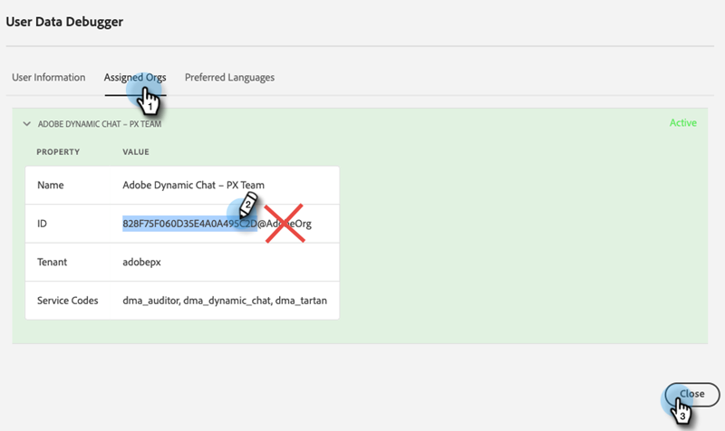
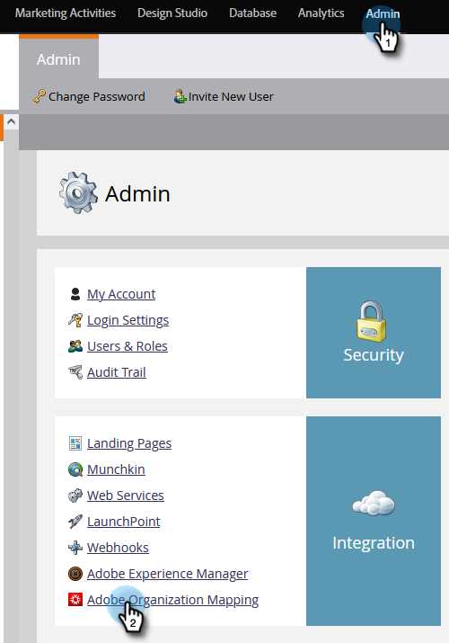

# Connect Dynamic Chat to Marketo {#connect-dynamic-chat-to-marketo}

After you've completed the [initial setup](/help/marketo/product-docs/demand-generation/dynamic-chat/initial-setup.md), it's time to perform the one-time sync connecting Dynamic Chat to your Marketo subscription.

1. In My Marketo, click the **Dynamic Chat** tile.

   

   >[!NOTE]
   >
   >If you don't see the tile, reach out to your Marketo Admin.

1. If you've previously accessed an application with an Adobe ID, you'll be taken straight to Dynamic Chat. If not, [set up your Adobe ID](https://helpx.adobe.com/manage-account/using/create-update-adobe-id.html).

1. To connect your Marketo instance, select **Integrations**.

   

1. On the Marketo card, click **Initiate Sync**.

   

>[!NOTE]
>
>It can take anywhere from 2 to 24 hours for the sync to complete, depending on the size of your database.

## Link Your Adobe Org and Marketo {#link-your-adobe-org-and-marketo}

Next, it's time to link Adobe and Marketo.

1. Log in to [experience.adobe.com](https://experience.adobe.com).

1. Copy the Org ID from the bottom-right corner of the homepage, _minus_ the "@AdobeOrg."

   

1. In Marketo, go to the **Admin** section and select **Adobe Organization Mapping**.

   

1. Click **Edit**.

   

1. Paste the Org ID you copied in Step 2 and click **OK**.

   

>[!MORELIKETHIS]
>
>[Initial Setup](/help/marketo/product-docs/demand-generation/dynamic-chat/initial-setup.md)
