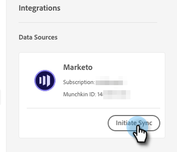

# Connect Dynamic Chat to Marketo {#connect-dynamic-chat-to-marketo}

After you've completed the [initial setup](/help/marketo/product-docs/demand-generation/dynamic-chat/initial-setup.md){target="_blank"}, it's time to perform the one-time sync connecting Dynamic Chat to your Marketo subscription.

1. In My Marketo, click the **Dynamic Chat** tile.

   

   >[!NOTE]
   >
   >If you don't see the tile, reach out to your Marketo Admin.

1. If you've previously accessed an application with an Adobe ID, you'll be taken straight to Dynamic Chat. If not, [set up your Adobe ID](https://helpx.adobe.com/manage-account/using/create-update-adobe-id.html){target="_blank"}.

1. To connect your Marketo instance, select **Integrations**.

   

1. On the Marketo card, click **Initiate Sync**.

   

1. Select up to 50 standard or custom fields from your Marketo instance to sync to Dynamic Chat for use in audience targeting, data mapping, and personalization. Click **Next** when done.

   

   >[!CAUTION]
   >
   >At this time, attribute selections **cannot** be changed after the initial sync. When the sync is done, you can only go back and add more (if you chose less than 50).

1. Review your selections (reminder: you cannot remove attributes post-sync, so click **Edit Selections** if you need to change any in this step). Click **Confirm** when done to initiate the sync.

   

>[!NOTE]
>
>It can take anywhere from 2 to 24 hours for the sync to complete, depending on the size of your database.

>[!MORELIKETHIS]
>
>[Initial Setup](/help/marketo/product-docs/demand-generation/dynamic-chat/initial-setup.md){target="_blank"}
