# Dialogues {#dialogues}

Dialogues are individual chat conversations. Learn how to customize them visually, determine what pages they appear on, and decide what is said as well as who sees it.

## Create a New Dialogue {#create-a-new-dialogue}

1. Click **Dialogues**.

   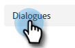

1. Click the **Create New** button.

   

1. Enter a name (description is optional), set the priority level, and click **Save**.

   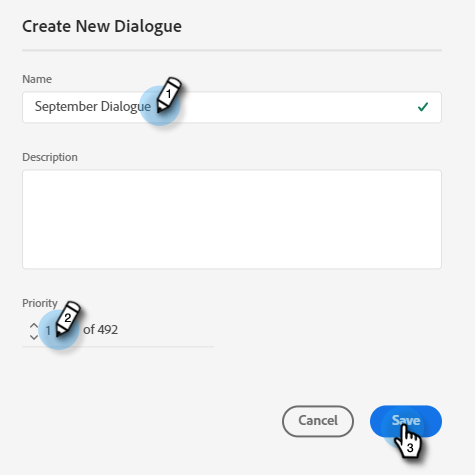

>[!NOTE]
>
>Priority determines which Dialogue will be shown to a visitor when they qualify for multiple Dialogues simultaneously.

## Audience Criteria {#audience-criteria}

Similar to Marketo Smart Lists, Audience Criteria attributes allow you to define your target audience. You can target known or unknown leads using inferred, lead, or company attributes (or a combination thereof).

**Known Leads**

There are _many_ attribute combinations to choose from. In this example we're targeting all **known leads** in California who work at a company with more than 50 employees.

1. Grab the **Lead State** attribute and drag it to the right.

   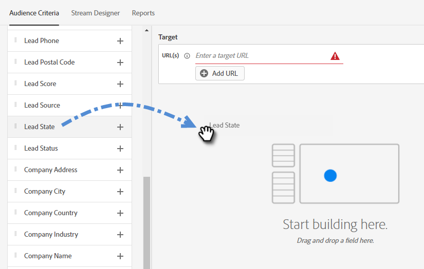

1. _Is_ is set by default. In the Select Values field, type in CA (you can also click the drop-down and select from the list).

   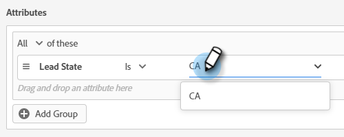

1. Grab the **Company Size** attribute and drag it to where it says _drag and drop an attribute here_.

   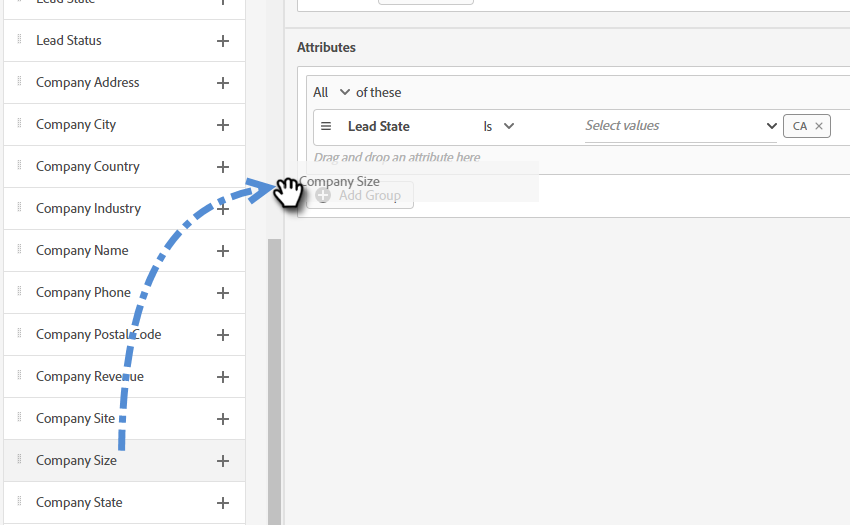

   >[!NOTE]
   >
   >You can also choose an attribute by clicking its **+** icon.

1. Click the operator drop-down and select **Greater Than**.

   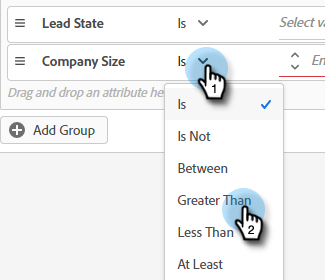

1. Type 50 and click elsewhere on the screen to save.

   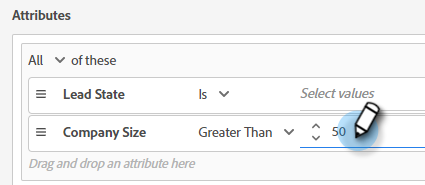

**Anonymous Leads**

There's an easy way to specifically target leads who are not in your database yet. In this example, we're targeting all **anonymous leads** located in the New York area.

1. Grab the **Lead Email** attribute and drag it to the right.

   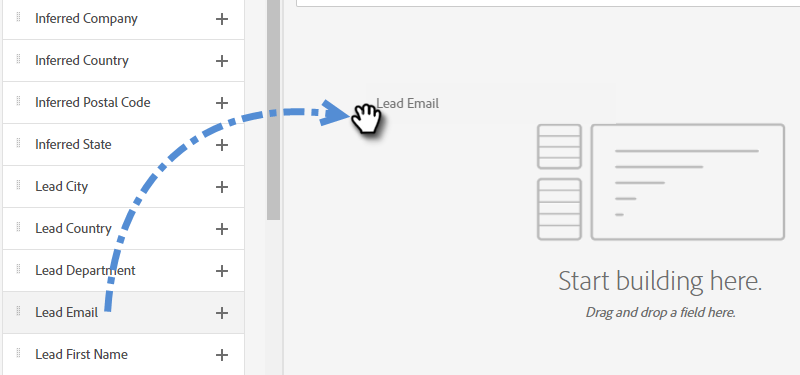

1. Click the operator drop-down and select **Is Empty**.

   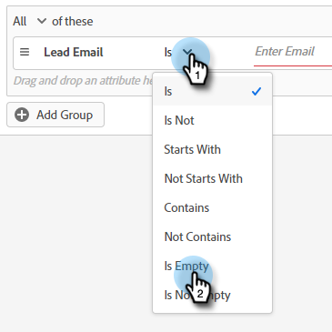

1. Grab the **Inferred State** attribute and drag it to where it says _drag and drop an attribute here_.

   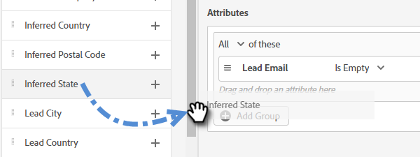

   >[!NOTE]
   >
   >When someone visits your website, [Munchkin](/help/marketo/product-docs/administration/additional-integrations/add-munchkin-tracking-code-to-your-website.md) cookies them and puts them into the system. We look up their IP in a special database and infer all kinds of good info.

1. _Is_ is set by default. In the Select Values field, type in NY (you can also click the drop-down and select from the list).

   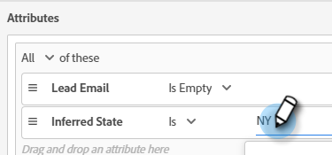

## Add Groups {#add-groups}

You have the option of grouping attributes as well, in case you want to have all of certain attributes along with "all or any" of another. You can add multiple groups.

   

   

## Target {#target}

This is where you enter the URL(s) that you want a specific Dialogue to be shown on.

Acceptable formats:

* `http://website.com`
* `https://*.website.com`
* `http://website.com/folder/*`
* `https://*.website.com/folder/*`

>[!NOTE]
>
>Using an asterisk acts as a catch-all wilcard. So `https://*.website.com` would put the dialogue on every page of the site, including subdomains (ex: `support.website.com`). And `https://website.com/folder/*` would put the dialogue on every HTML page in the subsequent folder (ex: in this case let's say the folder is "sports," so: website.com/sports/baseball.html, website.com/sports/football.html, etc.).

## Stream Designer {#stream-designer}

The stream designer contains different cards you can add to shape the chat conversation.

<table>
 <tr>
  <td><strong>Message</strong></td>
  <td>Use when you want to make a statement with no response necessary (ex: "Hi! All items are 25% off today with code SAVE25").
</td>
 </tr>
 <tr>
  <td><strong>Question</strong></td>
  <td>Use when you want to ask a multiple choice question, of which you supply the available responses (ex: What type of vehicle are you interested in? Responses = SUV, Compact, Truck, etc.).</td>
 </tr>
 <tr>
  <td><strong>Information Capture</strong></td>
  <td>Use when you want to collect information. The  three fields to choose from are Email Address, Phone Number, and Text (which allows the visitor to write their own message).</td>
 </tr>
 <tr>
  <td><strong>Appointment Scheduler</strong></td>
  <td>Provides the visitor with a calendar of available dates to schedule a follow-up. Calendar availability reflects [the next agent in line](/help/marketo/product-docs/demand-generation/dynamic-chat/dynamic-chat-overview.md#routing).</td>
 </tr>
 <tr>
  <td><strong>Goal</strong></td>
  <td>This is the only card the visitors won't see. It's for you to determine at which point a goal is achieved within the specific chat (ex: if collecting the visitor's email is your goal, place the Goal card after Info Capture in the Stream).</td>
 </tr>
</table>

**Create a Stream**

There are _many_ stream combinations to create. Let's look at just one example [in this article](/help/marketo/product-docs/demand-generation/dynamic-chat/create-a-stream.md).

## Reports {#reports}

In the Reports tab, view data from the past 90 days. Each category is defined below.

<table>
 <tr>
  <td><strong>Total Triggered</strong></td>
  <td>Increments every time a visitor qualifies for/is shown a Dialogue.
</td>
 </tr>
 <tr>
  <td><strong>Engaged</strong></td>
  <td>Increments every time a visitor clicks on the chatbot anchor to open the Dialogue.</td>
 </tr>
 <tr>
  <td><strong>Completed</strong></td>
  <td>Increments every time a visitor reaches the end of any branch in a Dialogue.</td>
 </tr>
 <tr>
  <td><strong>Leads Captured</strong></td>
  <td>Increments every time a visitor provides a valid email address in a Dialogue flow.</td>
 </tr>
 <tr>
  <td><strong>Meetings Booked</strong></td>
  <td>Increments every time a visitor successfully schedules an appointment via the chatbot.</td>
 </tr>
 <tr>
  <td><strong>Goals Reached</strong></td>
  <td>Increments every time a visitor reaches a goal in any Dialogue flow.</td>
 </tr>
</table>
