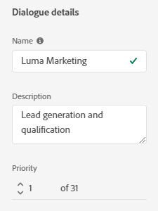
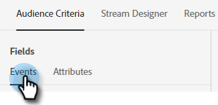
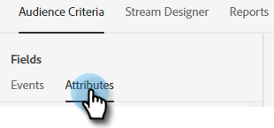

# Audience Criteria {#audience-criteria}

Similar to Marketo Smart Lists, Audience Criteria attributes allow you to define your target audience. You can target known or unknown people using inferred, person, or company attributes (or a combination thereof).

**Known People**

There are _many_ attribute combinations to choose from. In this example we're targeting all **known people** in California who work at a company with more than 50 employees.

1. Grab the **Person State** attribute and drag it to the right.

   

1. _Is_ is set by default. In the Select Values field, type in CA (you can also click the drop-down and select from the list).

   

1. Grab the **Company Size** attribute and drag it to where it says _drag and drop an attribute here_.

   

   >[!NOTE]
   >
   >You can also choose an attribute by clicking its **+** icon.

1. Click the operator drop-down and select **Greater Than**.

   

1. Type 50 and click elsewhere on the screen to save.

   

And that's it!

**Anonymous People**

There's an easy way to specifically target people who are not in your database yet. In this example, we're targeting all **anonymous people** located in the New York area.

1. Grab the **Person Email** attribute and drag it to the right.

   

1. Click the operator drop-down and select **Is Empty**.

   

1. Grab the **Inferred State** attribute and drag it to where it says _drag and drop an attribute here_.

   

   >[!NOTE]
   >
   >When someone visits your website, [Munchkin](/help/marketo/product-docs/administration/additional-integrations/add-munchkin-tracking-code-to-your-website.md) cookies them and puts them into the system. We look up their IP in a special database and infer all kinds of good info.

1. _Is_ is set by default. In the Select Values field, type in NY (you can also click the drop-down and select from the list).

   

## Add Groups {#add-groups}

You have the option of grouping attributes as well, in case you want to have all of certain attributes along with "all or any" of another. You can add multiple groups.

   

   

## Target {#target}

This is where you enter the URL(s) that you want a specific Dialogue to be shown on.

Acceptable formats:

* `http://website.com`
* `https://*.website.com`
* `http://website.com/folder/*`
* `https://*.website.com/folder/*`

>[!NOTE]
>
>Using an asterisk acts as a catch-all wilcard. So `https://*.website.com` would put the dialogue on every page of the site, including subdomains (ex: `support.website.com`). And `https://website.com/folder/*` would put the dialogue on every HTML page in the subsequent folder (ex: in this case let's say the folder is "sports," so: website.com/sports/baseball.html, website.com/sports/football.html, etc.).

>[!MORELIKETHIS]
>
>* [Create a Dialogue](/help/marketo/product-docs/demand-generation/dynamic-chat/dialogues/create-a-dialogue.md){target="_blank"}
>* [Stream Designer](/help/marketo/product-docs/demand-generation/dynamic-chat/dialogues/stream-designer.md){target="_blank"}
>* [Reports](/help/marketo/product-docs/demand-generation/dynamic-chat/dialogues/reports.md){target="_blank"}
