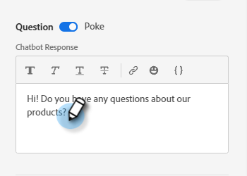
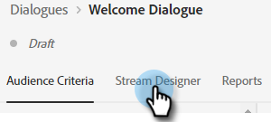
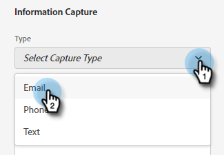
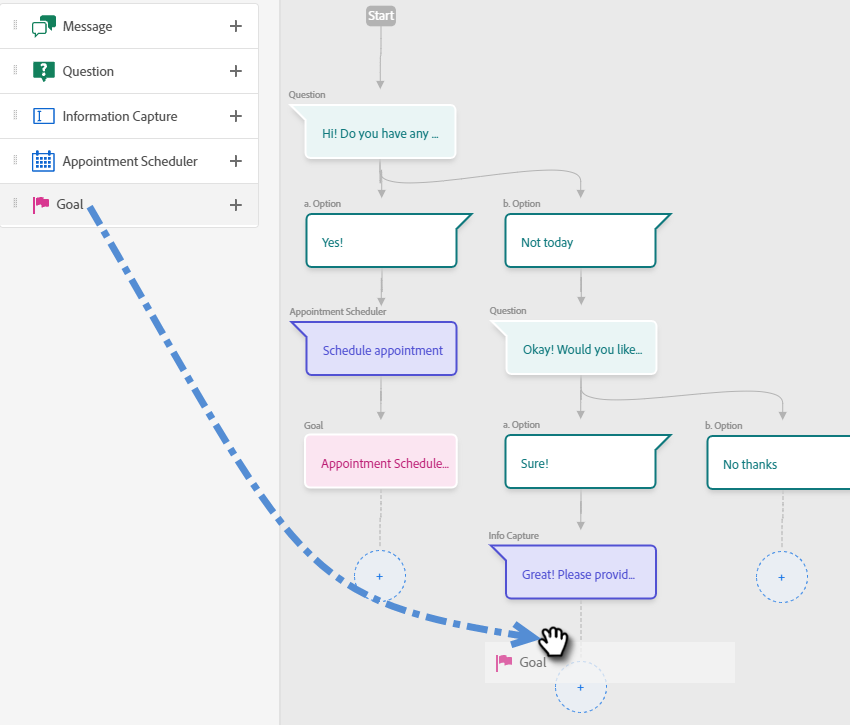
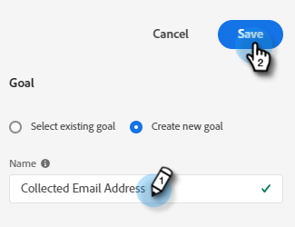
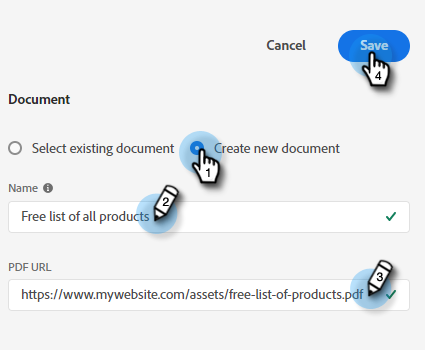
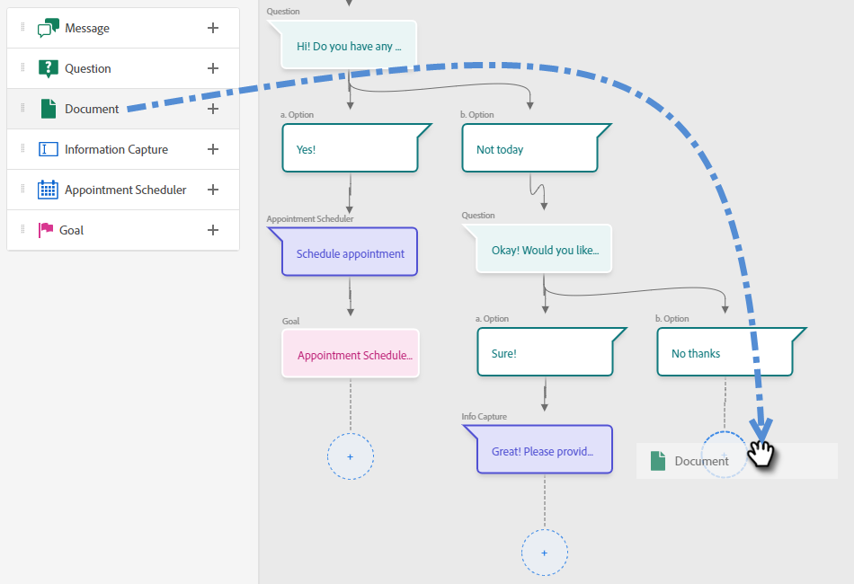
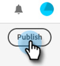

# Stream Designer {#stream-designer}

There are _many_ stream combinations possible. This article contains an example where the marketer asks the site visitor if they have any product questions. If yes, the visitor can schedule an appointment. If no, the visitor is given the option to join a mailing list for future correspondence. They're also offered a free PDF. The ultimate goal is either scheduling an appointment or collecting the visitor's email.

>[!PREREQUISITES]
>
>Before you can use the Document card, you must first [set it up](/help/marketo/product-docs/demand-generation/dynamic-chat/integrations/using-the-document-card.md){target="_blank"} in your Adobe account.

## Stream Designer Cards {#stream-designer-cards}

The stream designer contains multiple cards you can add to shape the chat conversation.

<table>
 <tr>
  <td><strong>Message</strong></td>
  <td>Use when you want to make a statement with no response necessary (ex: "Hi! All items are 25% off today with code SAVE25").
</td>
 </tr>
 <tr>
  <td><strong>Question</strong></td>
  <td>Use when you want to ask a multiple choice question, of which you supply the available responses (ex: What type of vehicle are you interested in? Responses = SUV, Compact, Truck, etc.).</td>
 </tr>
 <tr>
  <td><strong>Document</strong></td>
  <td>Allows you to embed PDF documents in Dialogues and track document engagement activity of visitors (how many pages were viewed, if the document was downloaded, and/or any search terms that were used).</td>
 </tr>
 <tr>
  <td><strong>Information Capture</strong></td>
  <td>Use when you want to collect information. The  three fields to choose from are Email Address, Phone Number, and Text (which allows the visitor to write their own message).</td>
 </tr>
 <tr>
  <td><strong>Appointment Scheduler</strong></td>
  <td>Provides the visitor with a calendar of available dates to schedule a follow-up. Calendar availability reflects <a href="/help/marketo/product-docs/demand-generation/dynamic-chat/dynamic-chat-overview.md#routing">the next agent in line</a>.</td>
 </tr>
 <tr>
  <td><strong>Goal</strong></td>
  <td>This is the only card the visitors won't see. It's for you to determine at which point a goal is achieved within the specific chat (ex: if collecting the visitor's email is your goal, place the Goal card immediately after Info Capture in the stream).</td>
 </tr>
</table>

## Stream Designer Icons {#stream-designer-icons}

In the upper-right of the Stream Designer, you'll see a handful of icons. Here's what they do.

<table>
 <tr>
  <td></td>
  <td>Adds a grid to the background for those who prefer that view</td>
 </tr>
 <tr>
  <td></td>
  <td>Zooms in, creating larger cards</td>
 </tr>
 <tr>
  <td></td>
  <td>Zooms out, creating smaller cards</td>
 </tr>
 <tr>
  <td></td>
  <td>Opens a window for you to test your chat (press the same button to close)</td>
 </tr>
 <tr>
  <td></td>
  <td>Organizes all of the cards in your stream</td>
 </tr>
</table>

## Create a Stream {#create-a-stream}

1. After you've [created your dialogue](/help/marketo/product-docs/demand-generation/dynamic-chat/dialogues/create-a-dialogue.md){target="_blank"}, click the **Stream Designer** tab.

   

1. Drag and drop the Question card.

   

1. Under Chatbot Response, word your question how you'd like.

   

   >[!NOTE]
   >
   >Poke is set to on by default, which displays the opening question next to the chat icon without the visitor having to click on it to see it. Poke is only available on the first card in the conversation.

1. Enter your User Responses and click **Save**.

   

   >[!NOTE]
   >
   >**Edit Stored Values** is an optional step for those who'd like to store a different value in the database than what's being displayed to visitors in the chatbot for mapped attributes in the Question card (ex: visitor sees "Search Engine Optimization," you store that value as "SEO.").

1. For "Yes" we want to schedule an appointment, so below that option drag over the Appointment Scheduler card.

   

1. In the column on the right, click **Save**.

   

1. Since that's a goal, drag the Goal card below the Appointment Scheduler.

   

1. Name your goal (or choose an existing one) and click **Save**.

   

1. For "No" we want to see if they'll join the mailing list, so below that option drag over another Question card.

   

1. Enter your response, and add response choices for the visitor. Click **Save** when done.

   

   >[!NOTE]
   >
   >You can add more responses by clicking **Add Response**.

1. Below the "Yes" response, drag over the Info Capture card so you can collect the visitor's email.

   

1. Click the **Type** drop-down and select **Email**.

   

1. Enter a chatbot message and placeholder. Make sure the attribute is mapped to the appropriate field in Marketo and click **Save**.

   

   <table>
    <tr>
     <td><strong>Type</strong></td>
     <td>The type of info you want to capture: Phone, Text, Email.</td>
    </tr>
    <tr>
     <td><strong>Chatbot Message</strong></td>
     <td>The message the visitor sees prompting them to provide the info.</td>
    </tr>
    <tr>
     <td><strong>Placeholder</strong></td>
     <td>Sample text helping the visitor see what to enter.</td>
    </tr>
    <tr>
     <td><strong>Map Response to Attribute</strong></td>
     <td>Allows you to sync the vistor's response to the corresponding field in their Person record in your Marketo subscription.</td>
    </tr>
   </table>

1. Since collecting their email is a goal, drag the Goal card below Info Capture.

   

1. Name your goal (or choose an existing one) and click **Save**.

   

1. Remember to add a response if they say "No." One option is to drag a Message card below and say "thanks anyway." But in this example, we'll provide them with a free PDF document instead.

   

1. In this example we'll create a new document. Give it a name, enter the URL to the PDF you already have hosted, and click **Save**.

   

1. Select the **Preview** toggle to preview your Dialogue.

   

1. When you're ready to activate your Dialogue, click **Publish**.

   

>[!NOTE]
>
>Before clicking Publish, remember to make sure you've [entered your target URL(s)](/help/marketo/product-docs/demand-generation/dynamic-chat/dialogues/audience-criteria.md#target){target="_blank"}.

>[!MORELIKETHIS]
>
>* [Create a Dialogue](/help/marketo/product-docs/demand-generation/dynamic-chat/dialogues/create-a-dialogue.md){target="_blank"}
>* [Audience Criteria](/help/marketo/product-docs/demand-generation/dynamic-chat/dialogues/audience-criteria.md){target="_blank"}
>* [Reports](/help/marketo/product-docs/demand-generation/dynamic-chat/dialogues/reports.md){target="_blank"}
>* [Using the Document Card](/help/marketo/product-docs/demand-generation/dynamic-chat/integrations/using-the-document-card.md){target="_blank"}
