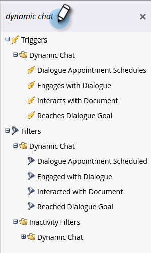

# Dynamic Chat Activities {#dynamic-chat-activities}

Dynamic Chat offers several filters and triggers for use in your Smart Lists.

   

## Definitions {#definitions}

<table>
<thead>
<tbody>
  <tr>
    <td><b>Triggered</b></td>
    <td>A trigger event occurs when a visitor meets the targeting criteria for a Dialogue or Conversational Flow and is shown the Dialogue.
     One trigger event per visitor, per session.</td>
  </tr>
  <tr>
    <td><b>Engaged with a Conversation Flow/Dialogue</b></td>
    <td>An engagement occurs the first time a web visitor clicks on a prompt in a Dialogue or Conversational Flow (clicking a multiple choice option, submitting information, booking a meeting, opening a document, etc). If a visitor opens a Dialogue or Conversational Flow, but does not click on a prompt, an engagement is <b>not</b> logged. 
     One engagement event per visitor, per session.</td>
  </tr>
   <tr>
    <td><b>Engaged with an Agent</b></td>
    <td>Happens when a visitor is successfully connected to a live chat agent.
     One engaged with agent event per visitor, per session.</td>
  </tr>
  <tr>
    <td><b>Interacted with Document</b></td>
    <td>Happens when a visitor clicks on a document in a document card.
     There can be multiple document interactions per visitor, per session.</td>
  </tr>
  <tr>
    <td><b>Reached Goal(s)</b></td>
    <td>Happens when a visitor reaches a goal.  There can be multiple goal-reached events per visitor, per session.</td>
  </tr>
  <tr>
    <td><b>Scheduled Meeting</b></td>
    <td>Happens when a visitor books a meeting with a Dynamic Chat agent.
     There can be multiple meeting-booked events per visitor, per session.</td>
  </tr>
</tbody>
</table>

## Things to Note {#things-to-note}

* Conditions are supported in Dynamic Chat flow steps
* Dynamic Chat activities can be synced to [Marketo Sales Insight](/help/marketo/product-docs/marketo-sales-insight/msi-for-salesforce/features/dynamic-chat-integration.md){target="_blank"}
* You can view individual Dynamic Chat activities in the Activity Log of a Person record
